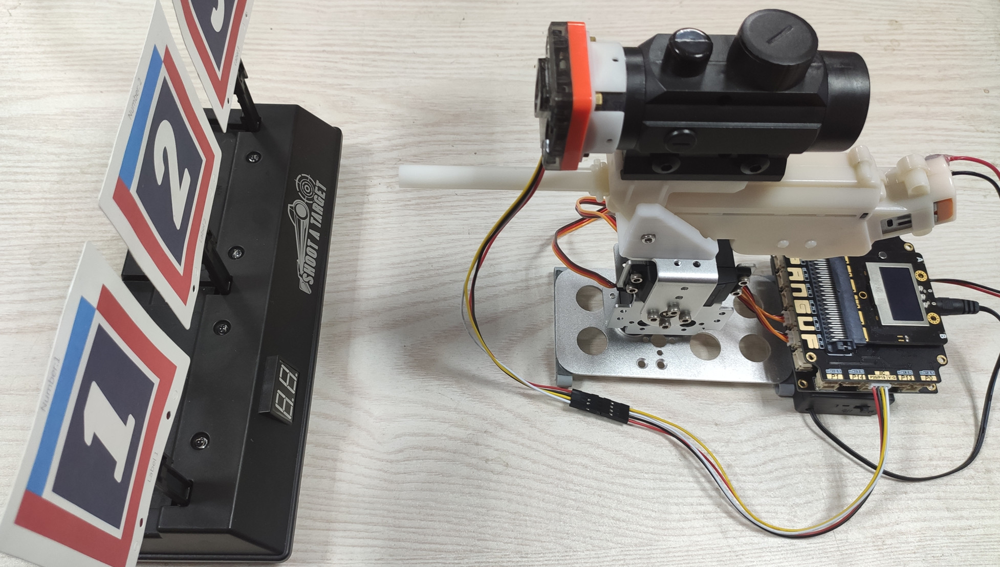
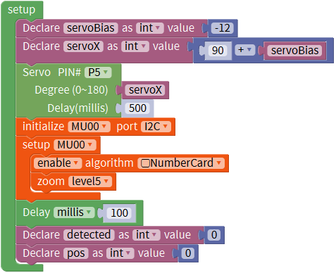
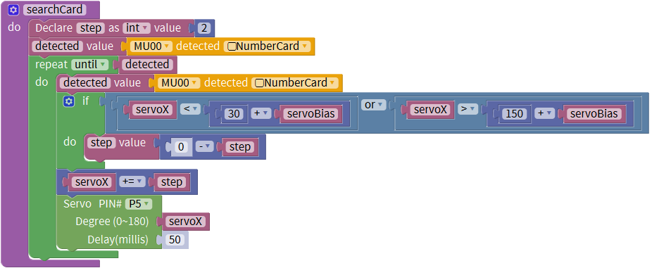
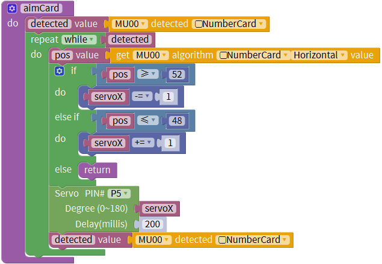
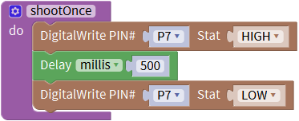
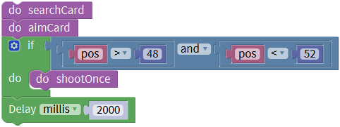
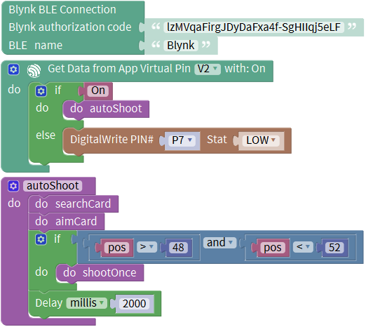

# Auto Cannon

## Introduction

This project is an auto shoot cannon based on direnjie kit and MoonBot structure parts.
MU vision sensor 3 is fixed on top of the cannon that can recognize the coordinates of the target.
So that the controller can control the servos and water gun to aim and shoot the target until clear.

## Contents

- A water gun

- Servo gimbal

- MU vision sensor 3

- Handbit controller

- Lipo battery + 18650 Power Li battery 

- Target with MU number cards

This is the auto cannon. The hardware is from direnjie kit and structure is from MoonBot Kit.
Other bracket parts can be 3d printed. 
Number cards are sticked to the original electric target so that the target can be recognized by MU.

## Program Example

- Initial Settings

Firstly the peripherals should be set, including servos and MU.

- Search Function

Move servos in horizontal direction to search card in the vision sight.

- Aim Function

When MU find a card, the program turns into aim function. Move servos slowly to adjust the position between cannon and card.

- Shoot Function

Simply control the P7 pin to shoot for 0.5 seconds. Time can be modified to save the bullet.

- Loop Program

Combine the above functions and make the program repeatly.

- Remote Control

Cannon can be settled by Blynk app through BLE. Put the loop program to blynk blocks. 
When touch the button on the phone, auto shoot program can be launched.

## War Game

Firstly, servos move to central position. The cannon moves from left to right and scan the target in the mean time. 
When meeting the number card, program turns into aim function.
When verify the target position is within 48 to 52 position, shoot for 2 seconds and return to search function again.
