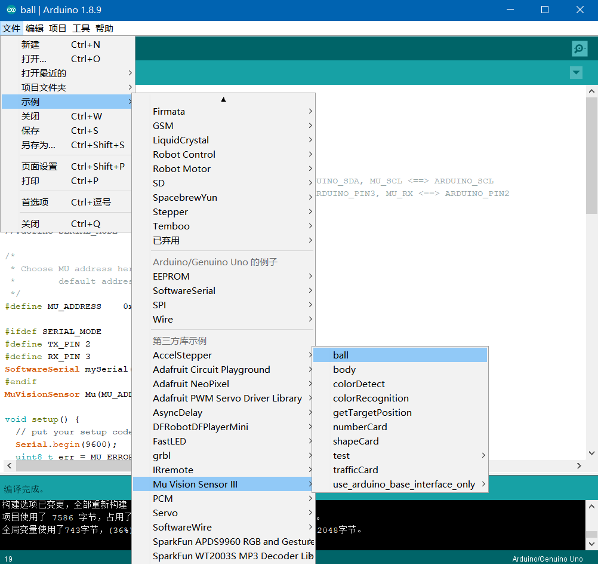
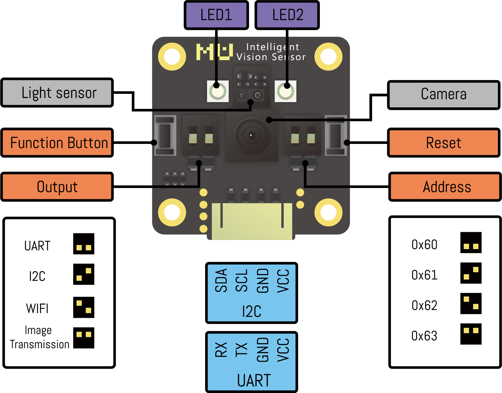

# Arduino库导入

在Arduino官网下载最新的Arduino IDE 1.8.9

<https://www.arduino.cc/en/Main/Software?setlang=cn>

在github下载最新的MUVisionSensorIII的Arduino库

<https://github.com/mu-opensource/MuVisionSensorIII>

按照默认路径安装Arduino IDE，则Arduino的第三方库在“文档\Arduino\libraries”文件夹下。

将下载的MUVisionSensorIII-1.1.6解压后放入该文件夹则完成导入。

打开Arduino IDE，选择顶部的“工具 - 开发板”，常用开发板为Arduino Uno。

如果使用MoonBot主控，则选开发板为Arduino Mega 2560，并选择处理器为ATmega 1280。连接开发板后选择相应端口则完成Arduino开发板的连接。

如果成功导入了开发板兼容的库，选择顶部的“文件 - 示例 - 第三方示例 - MU Vision Sensor III”可以打开官方示例程序。

# Arduino硬件连接

MU Vision Sensor 3的外设和接口如图所示：

## I2C模式

1）将模块左侧输出模式拨码开关1拨至下方，2拨至上方，切换至I2C模式；

2）（不推荐修改此设置）将模块右侧的地址选择拨码开关拨至对应位（默认地址0x60，1、2都在下方）；

3）将模块输出接口SDA口接至Arduino对应的SDA口，SCL口接至Arduino对应的SCL口。

## 串口模式

1）将模块左侧输出模式拨码开关1、2都拨至下方，切换至串口模式；

2）（不推荐修改此设置）将模块的地址选择拨码开关拨至对应位（默认地址1、2都在下方）；

3）将模块输出接口RX口接至Arduino对应的TX口，TX口接至Arduino对应的RX口。

# 示例说明

ball

body

colorDetect

colorRecognition

getTargetPosition

numberCard

shapeCard

trafficCard

arduino_base_interface
