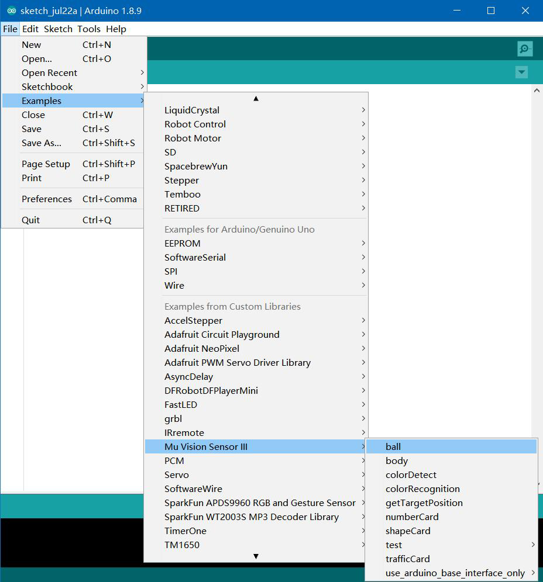

# Import Arduino Library for MU Vision Sensor

Download Arduino IDE at Arduino official website

<https://www.arduino.cc/en/Main/Software>

Download latest MU Vision Sensor library in github

<https://github.com/mu-opensource/MuVisionSensorIII>

Install the Arduino IDE, and third-part library is located in “Documents\Arduino\libraries”.
Unzip the MU Vision Sensor library and drag it into the libraries file to finish importing the library.

Open Arduino IDE, choose “Tools - Board” to change the development board. Arduino Uno is a popular board. 
If you use the MoonBot controller board, you should choose Arduino Mega 2560, and choose the processor ATmega 1280. 
Then connect the board and choose the right COM port.

If the library is successfully imported, the examples of MU is shown in ”File - Examples - Mu Vision Sensor III”.
Open an example and verify it to check wether the library can be compiled.

# Connect to Arduino

MU Vision Sensor 3 periphrals and ports：

## I2C Mode(recommended)

(1) Output Protocol Switch: set switch 1 downwards and switch 2 upwards.

(2) Connect the output SDA pin of MU to the SDA pin of Arduino, and SCL pin of MU to SCL pin of Arduino.

(3) Choose the I2C address of MU by setting Address Switch. Both switches are downwards and the address is set to 0x60 on default. (Changing this setting is not recommended).

## Serial Mode*

(1) Output Protocol Switch: set both switchs downward.

(2) Connect the output RX pin of MU to TX pin of Arduino and TX pin of MU to RX pin of Arduino.

(3) Change the UART address of MU sensor by resetting Address Switch. Both switches are downwards and the address is 0x60 on default. (Changing this setting is not recommended)

\* Arduino cannot send messages to PC when MuVisionSensor is running in hardware serial mode, due to a communication conflict.

# Examples

ball

body

colorDetect

colorRecognition

getTargetPosition

numberCard

shapeCard

trafficCard

arduino_base_interface
