# Import Extensions
Run MakeCode (open https://MakeCode.microbit.org/  in the web browser or use an offline version of MakeCode, which can be downloaded from Microsoft MakeCode website (https://www.microsoft.com/en-us/makecode)).
Start a new project, find Extensions in Advanced menu.

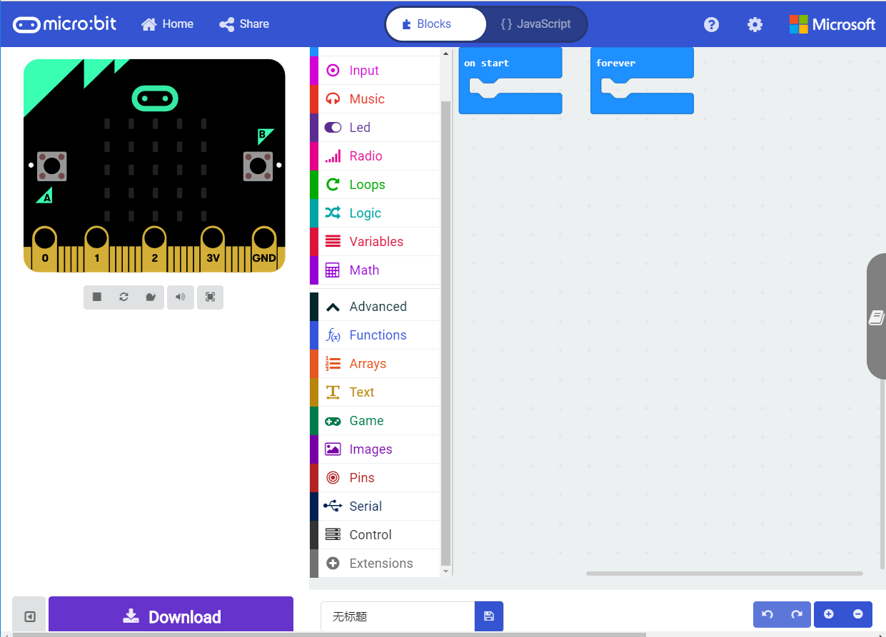

Type**mu-opensource/pxt-MuVisionSensor3**in the search box, click search and find‘MUVisionSensor’from the results list. 
Click to import the extension into MakeCode.

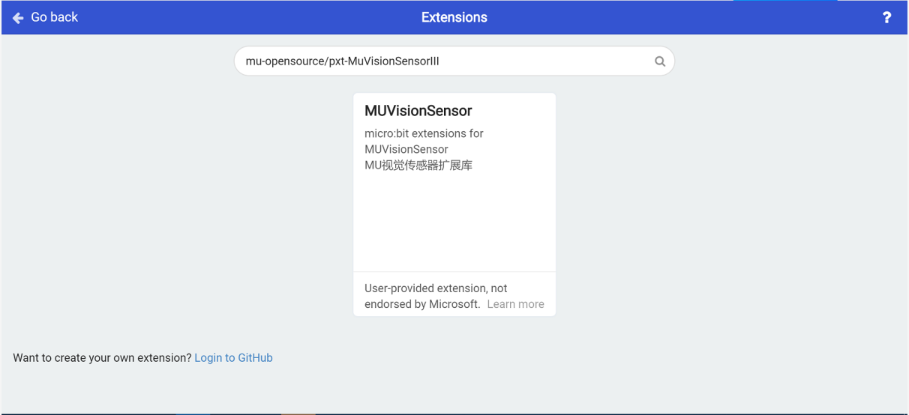

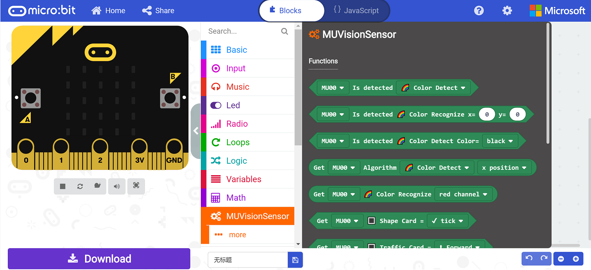

# Connect to Micro:bit 

MU Vision Sensor 3 periphrals and ports：

## I2C Mode (recommended)

(1) Output Protocol Switch: set switch 1 downwards and switch 2 upwards

(2) Connect the output Pin1(SDA) to the Pin20 of Micro:bit, and Pin2(SCL) to Pin19  of Micro:bit

(3) Choose the I2C address of MU sensor by resetting Address Switch.  By default, both switches are downward and the address is set to 0x60. 
(Changing this setting is not recommended)

## Serial Mode

(1) Output Protocol Switch: both switchs are downward

(2) Connect the output Pin1(RX) to Pin13(TX) of Micro:bit and Pin2(TX) to Pin16(RX) of Micro:bit

(3) Change the UART address of MU sensor by resetting Address DIP Switches. By default, both switches are downward and the address is 0x60. (Changing this setting is not recommended)

*Micro:bit cannot send messages to PC when MuVisionSensor is running in serial mode, due to a communication conflict.

*The default communication baud rate is 9600 and cannot be modified.

# Instructions of the Programming Blocks

## Block Introduction

**1.Initialization**

(1)Serial Mode：In serial mode, two pins are defined as TX & RX respectively, according to the hardware connection to the MU Vision Sensor，P12 and P13 as example。

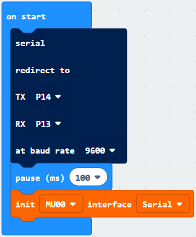

(2)I2C Mode

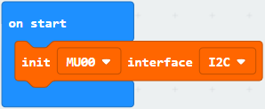

**2.Enable Vision Algorithms**

Seven recognition algorithms are integrated in current firmware(Version A).For detailed information please refer to the datasheet of MU vision sensor.

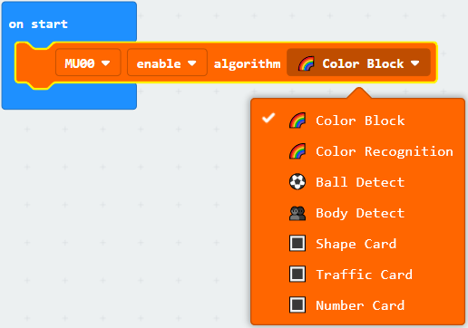

**3.Set Performance Level**

Algorithm performance differs in accuarcy and speed. Performance settings can be changed to fit in certain applications.

Default setting: Balance level.

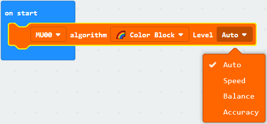

**4.Enable/Disable the High FPS Mode**

The camera is in high FPS mode by default,which has a higher speed than normal mode.High FPS mode can be turned off to save power.

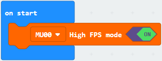

**5.Set White Balance Mode**

Ambient light will influence the detect result of the vision sensor, especially color detection and recognition.
In complex light environment or in color recongnition mode, it is recommended to lock white balance.

Reset the vision sensor, and put it in front of a white paper to measure brightness. A few seconds later, white balance will be locked.

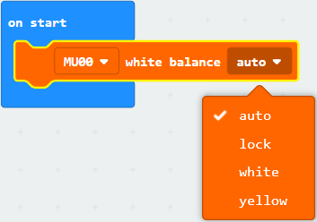

**6.Set Digital Zoom Level**

Larger digital zoom level means longer detectable distance, and view sight is narrower meanwhile. 

To get a better detect results, set a proper zoom level for the algorithm and test it.

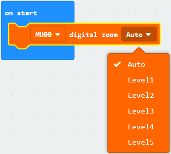

**7.On-board LED Settings**

Two on-board LED lights can be programmed to shine different colors when The sensor has detected an object or not.

Default setting: When undetected objects , two lights are red and when detected they are blue.

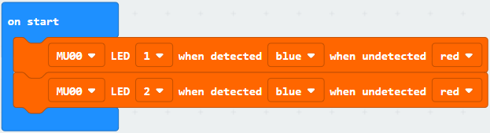

**8.Restore Default Settings**  

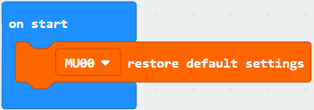

## Get Detection Results

**(1)Ball/Body Detection**

Setup program: Init I2C connection, and set algorithm to ball detect. Other settings are default.

Loop program: If MU detected a ball, it will send data to Micro:bit through I2C interface. And PC get the data from Micro:bit through USB serial port.The data contains position and size of the ball.

Actual result: After resetting MU and Micro:bit, LED lights flash red. When MU detected a ball, LED lights flash blue and Makecode console will display the data.

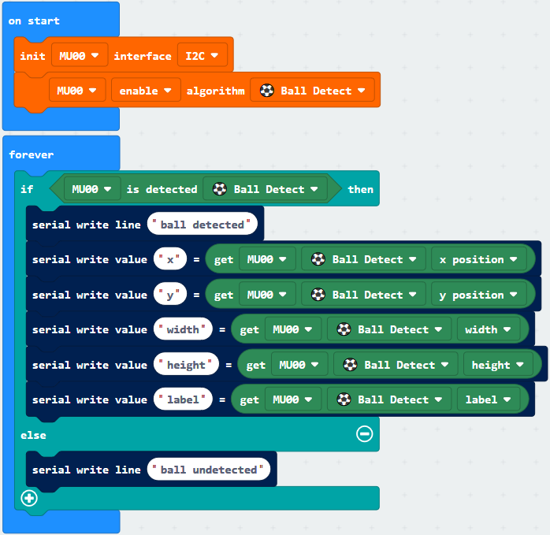

**(2)Card Detection**

Setup program: Init I2C connection, and set algorithm to traffic card. Other settings are default.

Loop program: If MU detected traffic card, it will send data to Micro:bit through I2C interface. And PC get the data from Micro:bit through USB serial port.The data contains position, size and type of the traffic card.

Actual result: After resetting MU and Micro:bit, LED lights flash red light. When MU detected a traffic card, LED lights flash blue and Makecode console will display the data.

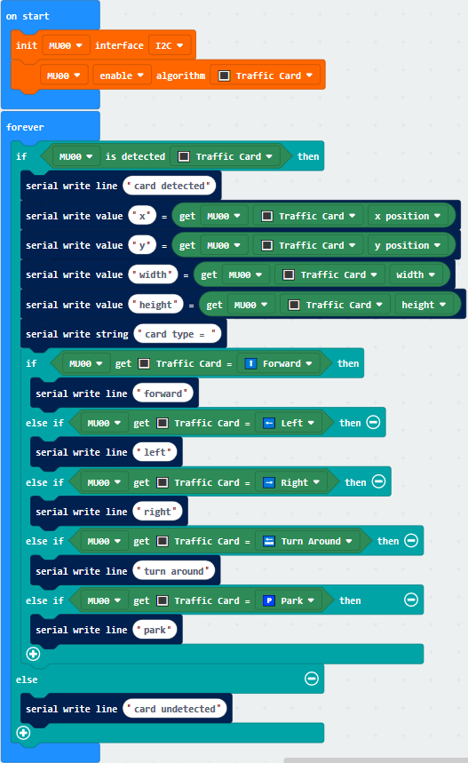

**(3)Color Recognition**

Setup program: Init I2C connection, and set algorithm to color recognition. Lock the white balance to get a higher accuracy.Other settings are default.

Loop program: If MU detected color at (50,50), it will send data to Micro:bit through I2C interface. And PC get the data from Micro:bit through USB serial port.The data contains RGB channel and type of the color.

Actual result: After resetting MU and Micro:bit, LED lights are off. Makecode console will display the data.

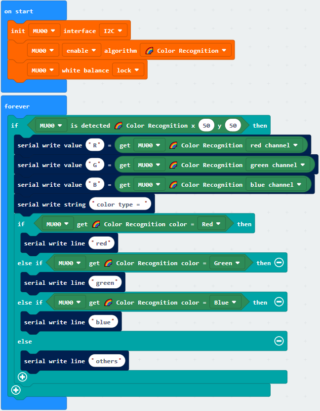

**(4)Color Block Detection**

Setup program: Init I2C connection, and set algorithm to color block. Lock the white balance to get a higher accuracy. Other settings are default.

Loop program: If MU detected a color block, it will send data to Micro:bit through I2C interface. And PC get the data from Micro:bit through USB serial port.The data contains position, size and type of the color block.

Actual result: After resetting MU and Micro:bit, LED lights flash red light. When MU detected a color block, LED lights flash blue and Makecode console will display the data.

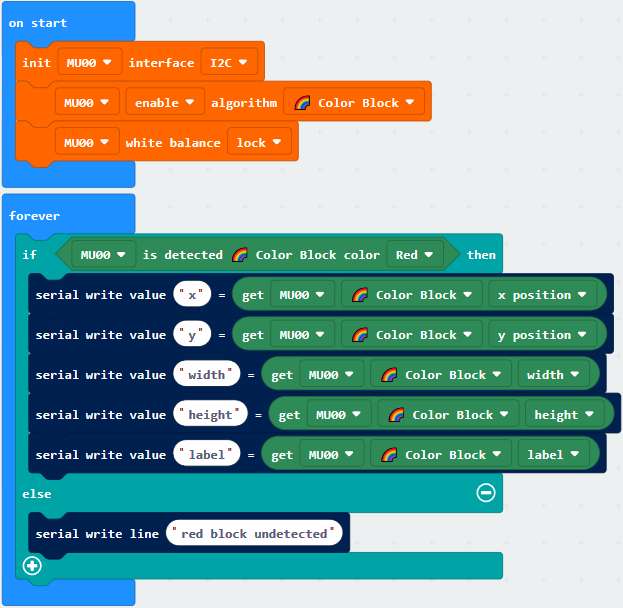

**(5)Serial Mode Example**

Change the output protocol switch to serial mode and connect MU to Micro:bit through serial port.In this mode PC cannot communicate with Micro:bit, so the led dot screen of the Micro:bit is used to display the data directly.

Setup program: redirect the serial port to P14 and P13, and select  ‘Number Card’algorithm. Other settings are default.

Loop program: If MU detects one number card, it will send data to Micro:bit through serial interface. The Micro:bit LED screen shows the number.

Actual result: After resetting MU and Micro:bit, LED lights flash red light. When MU detected a number 1 card, LED lights flash blue and Micro:bit screen shows 1.

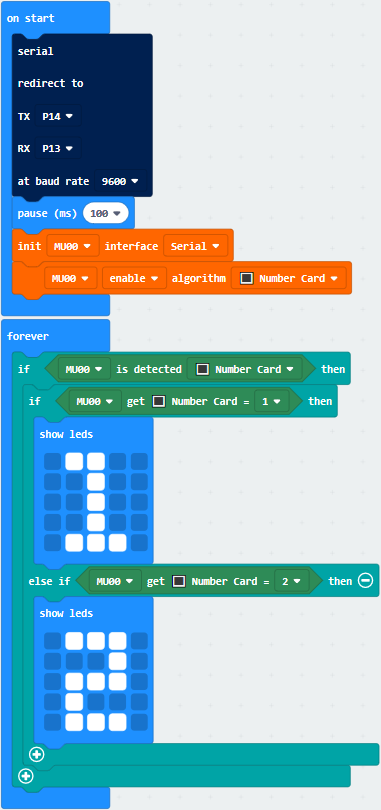
