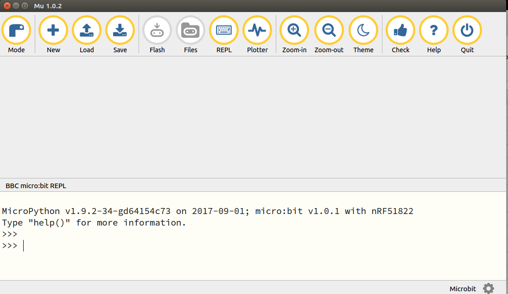

# 配置Mu Editor和Micro:bit
Mu Editor是一款具有友好GUI界面的MicroPython集成开发工具，包含了代码编辑、烧录、REPL终端、串口绘图器等功能。通过Micro:bit主板控制小MU视觉传感器，需要使用包含了MUVisionSensor传感器的MicroPython固件，请按以下步骤进行设置：

（1）下载Micro:bit固件：

GitHub：<https://github.com/mu-opensource/MuVisionSensor3-MicroPython>

morpx官网：<http://mai.morpx.com/page.php?a=sensor-support>

（2）更新Micro:bit固件：

将Micro:bit通过USB线连接电脑，出现Micro:bit的磁盘，将下载的固件microbit-micropython-MuVisionSensor-0.8.0.hex 文件拖入磁盘中，Micro:bit将自动更新固件并重启。

（3）下载并安装Mu Editor：<https://codewith.mu/>

（4）导入传感器

打开Mu Editor，在顶部选择模式为 BBC micro:bit，连接micro:bit后左下角显示“连接到新的micro:bit 设备”即可进行编程。单击顶部REPL按钮进入串口实时模式，micro:bit将返回固件版本信息。输入：

```python
>>> from MuVisionSensor import *
```

导入传感器后即可使用MuVisonSensor类中的所有公开API

*MuVisionSensor传感器中关键字的自动补全仅在REPL模式下可用



# Micro:bit硬件连接

MU Vision Sensor 3的外设和接口如图所示：


（1）将传感器左侧输出模式拨码开关1拨至下方，2拨至上方；

（2）将传感器输出接口SDA引脚（P1）和SCL引脚（P2）接至Micro:bit 对应的 SDA引脚（P20）与SCL引脚（P19），同时将P3接地，P4接电源（3.3-5V）；

（3）将传感器的地址选择拨码开关拨至对应位（默认地址0x60则 1、2都在下方，不推荐修改此设置）。

*目前仅支持I2C模式

# API使用说明

## 初始化传感器

1.调用MuVisionSensor(adress)创建一个对象mu，并指定传感器地址，指定的地址要与地址选择拨码开关的设置保持一致

2.调用begin()函数，启动传感器

## 开启算法

**API:**

```python
MuVisionSensor.VisionBegin(vision_type)
```

目前支持的vision_type有：

`VISION_COLOR_DETECT`        颜色检测

`VISION_COLOR_RECOGNITION`   颜色识别

`VISION_BALL_DETECT`         球体检测

`VISION_BODY_DETECT`         人体检测

`VISION_SHAPE_CARD_DETECT`   形状卡片检测

`VISION_TRAFFIC_CARD_DETECT` 交通卡片检测

`VISION_NUM_CARD_DETECT`     数字卡片检测

`VISION_ALL`                开启所有算法

**示例：**

```python
from MuVisionSensor import *  #导入库
.... #省略初始化过程
mu.VisionBegin(VISION_COLOR_DETECT)  #开启颜色检测算法
mu.VisionBegin(VISION_SHAPE_CARD_DETECT | VISION_BALL_DETECT) #同时开启形状卡片检测和球体检测算法
```

## 设置算法性能

**API:**

```
MuVisionSensor.VisionSetLevel(vision_type, level)
```

可选的vision_type同上

可选的level有：

`LevelDefault`  默认

`LevelSpeed`  速度优先

`LevelBalance`  平衡

`LevelAccuracy` 准确性优先

**示例：**

```
mu.VisionSetLevel(VISION_BALL_DETECT, LevelSpeed)
```

### 获取算法性能

**API:**

```
mu.VisionSetLevel(vision_type)
```

返回值0~3代表四种算法性能

## 设置摄像头帧率模式

高帧率模式下识别速度增加，同时功耗增加

**API:**

```
MuVisionSensor.CameraSetFPS(mode)
```

可选的mode有：

`FPSNormal` 正常模式

`FPSHigh` 高帧率模式

### 获取摄像头帧率模式

**API:**

```
MuVisionSensor.CameraGetFPS()
```

返回值为 0(FPSNormal)或1(FPSHigh)

## 设置摄像头白平衡

调节因为外界光源变化而引起的图像偏色

**API:**

```
MuVisionSensor.CameraSetAwb(mode)
```

可选的mode有：

`AutoWhiteBalance`		自动白平衡

`LockWhiteBalance`		锁定白平衡

`WhiteLight`      		白光模式

`YellowLight`     		黄光模式

### 获取摄像头白平衡模式

**API:**

```
MuVisionSensor.CameraGetAwb()
```

返回值为 0~3，对应4种白平衡模式

## 设置摄像头数码变焦

**API:**

```
MuVisionSensor.CameraSetZoom(mode)
```

可选的mode有：

`ZoomDefault` 默认

`Zoom1` 变焦模式1

`Zoom2` 变焦模式2

`Zoom3` 变焦模式3

`Zoom4` 变焦模式4

`Zoom5` 变焦模式5

### 获取摄像头变焦模式

**API:**

```
MuVisionSensor.CameraGetZoom()
```

返回值为 0~5，对应6种白平衡模式

## 板载LED灯光设置

**API:**

```
MuVisionSensor.LedSetColor(led, detected_color, undetected_color, level)
```

参数说明：

led：要配置的LED灯，可选值为

`Led1` 板载LED1

`Led2` 板载LED2

detected_color：检测到结果时的颜色，可选值为

`LedClose` LED关

`LedRed` 红色

`LedGreen` 绿色

`LedYellow`	黄色

`LedBlue` 蓝色

`LedPurple` 紫色

`LedCyan` 青色

`LedWhite` 白色

undetected_color：未检测到结果时的颜色，可选值同上

level：亮度值，可输入0~15的数字，数值越大越亮

## 恢复模块默认设置

关闭所有算法，重置所有硬件设置

**API:**
```
MuVisionSensor.SensorSetDefault()
```

## 重启传感器

**API:**
```
MuVisionSensor.SensorSetRestart()
```

## 获取算法识别结果

**API:**
```
MuVisionSensor.GetValue(vision_type, object_inf)
```

vision_type的可选值同上

object_inf的可选值为：

`Status` 检测状态，0代表没检测到，1代表检测到

`XValue` 目标的横向坐标

`YValue` 目标的纵向坐标

`WidthValue` 目标的宽度

`HeightValue` 目标的高度

`Label` 目标的标签

`RValue` 红色通道值（颜色识别模式）

`GValue` 绿色通道值（颜色识别模式）

`BValue` 蓝色通道值（颜色识别模式）
