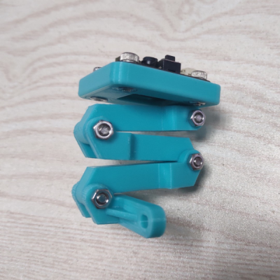

# Technical Information

Thanks for purchasing MU Vision Sensor 3, and we would like to provide continuous updating service, please check to our website: www.morpx.com regularly. 
Updates are subject to change without notice. You can get the latest technical information from the following websites:

Product Support: <http://mai.morpx.com/page.php?a=sensor-support>

GitHub: <https://github.com/mu-opensource/>

# 3D Printing Bracket

For customers bought bare MU board, we provide 3D printing cover and foldable bracket.It can be fixed anywhere and can be adjusted to any angle.
Please print by yourself if you have a 3D printer.

[MU3 3D Printing Bracket](https://github.com/mu-opensource/Morpx-docs-en/raw/master/MUVS3/MUVS3_Resource/sources/MU_foldable_bracket.zip)

# Platform Links

MU视觉传感器可以和各类开源软硬件配合使用，查看各类开源平台以学习其基础知识。

**Mixly**

Mixly Official Website: <http://mixly.org/>

**Arduino**

Arduino Official Website: <https://www.arduino.cc/>

**Micro:bit**

Micro:bit Official Website: <https://microbit.org/>

MakeCode: <https://makecode.microbit.org/#>

**MicroPython**

MicroPython Official Website: <http://micropython.org/>

Mu IDE: <https://codewith.mu/>
