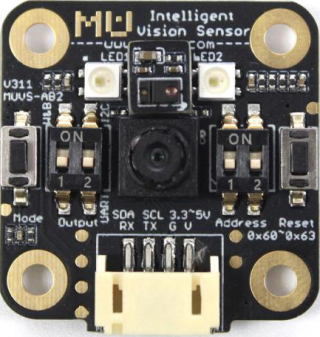
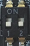
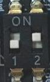
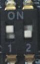
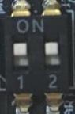

.. morpx documentation master file, created by
   sphinx-quickstart on Fri Jul 19 17:00:19 2019.
   You can adapt this file completely to your liking, but it should at least
   contain the root `toctree` directive.

MU Vision Sensor 3 Introduction
===============================

MU Vision Sensor 3(MU 3) is an intelligent vision sensor that can recognize many kinds of objects with deep-learning algorithm inside.
For example, it can detect color blocks, balls, human body and cards.Its detect result can be transmitted through UART or I2C interface.
MU 3 is compact, low power consumption, process all algorithms locally, 
and can be widely used in intelligent toys, AI+STEAM lessons, creators and other products or fields.

Hardware Setup
--------

1. Set Communication Mode
+++++++++++++++

MU supports 4 kinds of communication modes: ``UART,I2C,WIFI,image transmission`` . Change mode by switching ``Output`` switch on left side of MU.

After choosing mode, communication mode in program should be same as switch to make the codes working. 
Choose communication mode before coding, and then set other parameters.Every time changing communication mode, MU must be restarted.

+------------------------+----------+--------+--------------+
|      output mode       |  switch  | number | LED indicate |
+========================+==========+========+==============+
|         UART           | |FUNC00| |   00   | flash red    |
+------------------------+----------+--------+--------------+
|         I2C            | |FUNC01| |   01   | flash green  |
+------------------------+----------+--------+--------------+
|         WiFi           | |FUNC10| |   10   | flash yellow |
+------------------------+----------+--------+--------------+
|   image transmission   | |FUNC11| |   11   | flash purple |
+------------------------+----------+--------+--------------+

2. Set Address
+++++++++++

MU supports 4 address: ``0x60`` (default), ``0x61`` , ``0x62`` , ``0x63`` . Address should be changed when conflicted with other sensors.
In I2C modes, several MU sensors can work together with different address.

.. note::

    Use default address ``0x60`` normally.

+----------------+----------+--------+----------------+----------+--------+
| device address |  switch  | number | device address |  switch  | number |
+================+==========+========+================+==========+========+
|      0x60      | |FUNC00| |   00   |      0x61      | |FUNC01| |   01   |
+----------------+----------+--------+----------------+----------+--------+
|      0x62      | |FUNC10| |   10   |      0x63      | |FUNC11| |   11   |
+----------------+----------+--------+----------------+----------+--------+

3. Wire Connection
+++++++++++

:UART/WiFi/image transmission modes:

    +------------+----+----+-----+----+
    |      MU    | RX | TX |  G  | V  |
    +------------+----+----+-----+----+
    | controller | TX | RX | GND | 5V |
    +------------+----+----+-----+----+

:I2C modes:

    +------------+-----+-----+-----+----+
    |     MU     | SCL | SDA |  G  | V  |
    +------------+-----+-----+-----+----+
    | controller | SCL | SDA | GND | 5V |
    +------------+-----+-----+-----+----+

Software Setup
--------

Check detailed instructions among platforms below.

Special modes introduction
------------

.. _wifi-connect:

WiFi/image transmission mode network distribution
++++++++++++++++++++

In WiFi/iamge transmission mode, distribute network by sending AT command to MU. Default serial baudrate is 9600.

Send following command to know all AT commands：

.. code-block:: shell

    AT+HELP

.. attention::

    all commands should end with ``"\r\n"`` or ``' '`` .

MU supports ``AP`` and ``STA`` modes to connect to network. Here is difference between two ways: 

:AP mode:

    ``AP`` mode is default WiFi mode of MU. In this mode, MU will establish a WiFi hotspot for user to connect.
    When WiFi connect successfully,LED of MU will turn off.

    Default hotspot name is ``MORPX-MU-AB`` .

    .. note::

         ``A`` stands for initial word of LED color on the left, and ``B`` stands for initial word of LED color on the right.

        （For enample: left LED is **R** ed, right LED is **Y**ellow, then default WiFi name is ``MORPX-MU-RY``）

    Send following AT command to change  WiFi name: 

    .. code-block:: shell

        AT+WIFISET=<yourSSID>,<yourPassword>,AP
        AT+WIFICON=1

    If succeed, returns: 

    .. code-block:: shell

        OK
        wifi ap mode starting...
        OK

:STA mode:

    ``STA`` mode means MU and another device should connect to the same WiFi to get each connected.
    Send following commands to configure:

    .. code-block:: shell

        AT+WIFISET=<yourSSID>,<yourPassword>,STA
        AT+WIFICON=1

    .. attention::

        ``<yourSSID>`` 和 ``<yourPassword>`` should be an available WiFi(case sensitive), or connection failed.

    If set successfully, return: 

    .. code-block:: shell

        OK
        wifi sta mode connecting...
        OK

Watch image in image transmission mode
++++++++++++++++

Set MU to image transmission mode and complete :ref:`WiFi connect <wifi-connect>` , images can be watched through website ``192.168.4.1`` .

Wireless Transmission
++++++++

MU can transmit data in WiFi/image transmission modes.Complete :ref:`WiFi connect <wifi-connect>` and then take following steps: 

    .. note::

        TCP/UDP software are different in PC or mobile devices, here are some common definition: 

        - ``local IP`` :  IP address of MU
        - ``target IP`` : IP address of target device that MU send to

    1. Open TCP/UDP software, choose ``UDP``, and change mode to ``Unicast``
    2. Search local IP by sending command to MU: 

    .. code-block:: shell

        AT+WIFISIP

    Return MU local IP.

    3. Set TCP/IP to MU local IP, and port is ``3333``

    .. note::

        In STA mode router will distribute a random address for MU and target device. Take following steps: 

        1. Search target IP (Most TCP/IP software will show local IP address)
        2. Send command to MU: 

        .. code-block:: shell

            AT+WIFIUDP=<targetIP>,3333

        Return:

        .. code-block:: shell

            OK

Now WiFi configuration is finished, and all the data from TCP/UDP software will show on MU serial port, and 
all data from MU serial port will show on TCP/UDP software.

