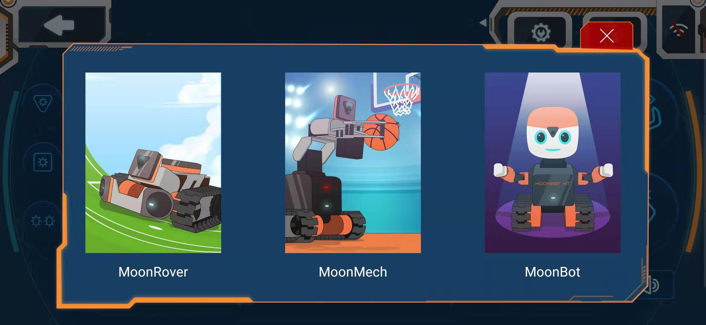
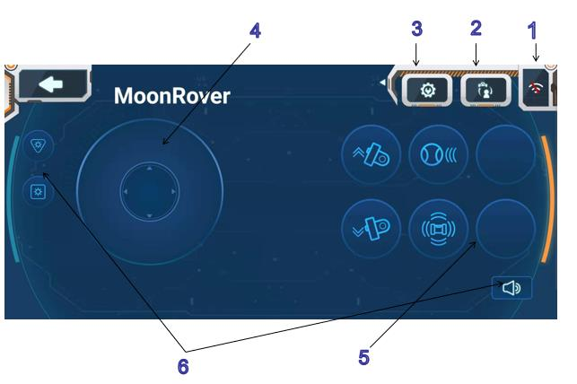
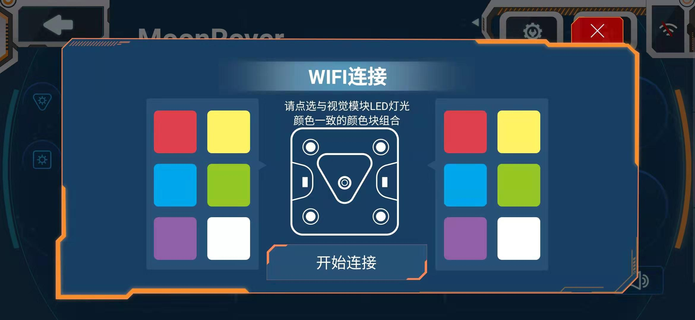
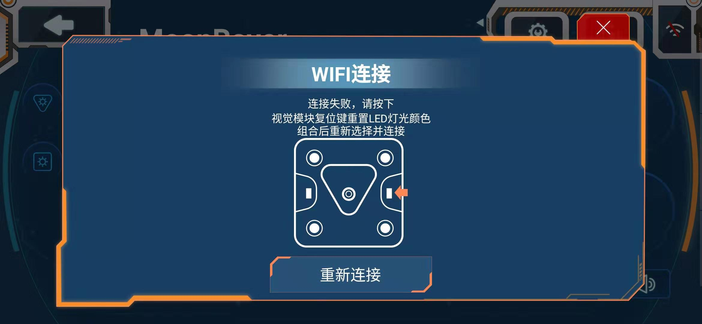
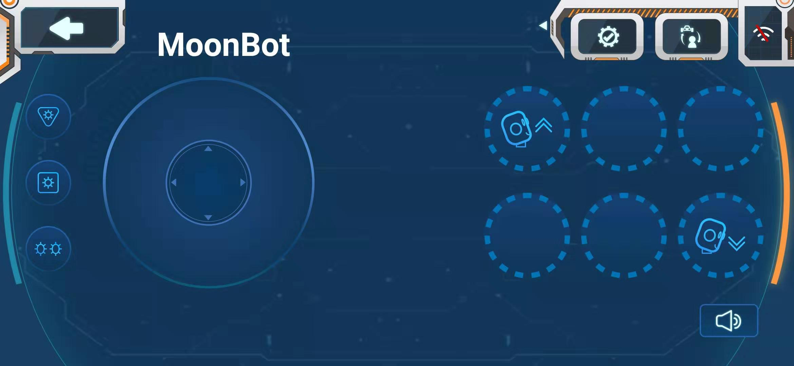
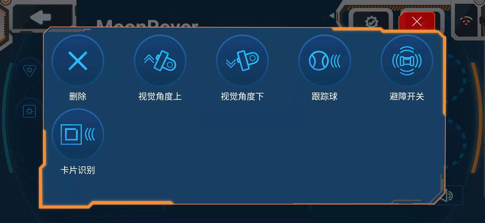
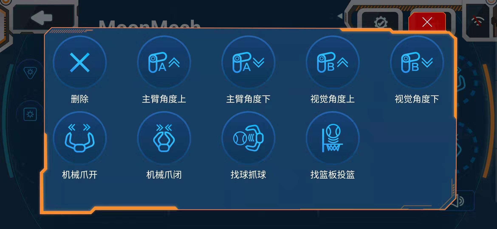
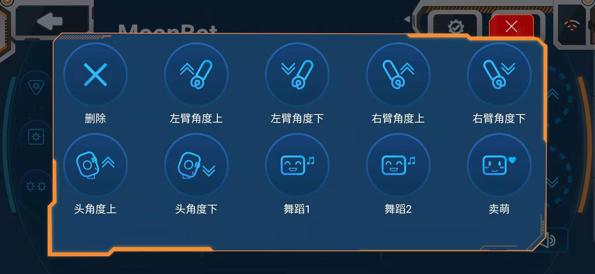

# APP控制器

首次进入APP控制器功能，选择对应搭建好的形态。

## 控制器使用简介

1.WiFi连接

点选与视觉模块LED灯光颜色一致的颜色块组合开始连接。连接失败时，可按视觉模块复位键重新点选连接。

2.形态选择

点击后在三种搭建形态中选择对应搭建好的形态。

3.设置功能键

点击设置功能键，下方功能键圆形框呈虚线，点击虚线圆框可增加删除替换各个功能至圆形框内，点击设置功能键完成设置。

 
4.轮盘控制

连接好wifi后可通过轮盘控制机器人运动

5.功能键

点击已设置的功能键使机器人做出相应的动作，不同形态机器人功能各不一样。

车形态内置功能：视觉角度上、视觉角度下、跟踪球、避障开关、卡片识别

机械臂形态内置功能：主臂角度上/下、视觉角度上/下、机械爪开/闭、找球抓球、找篮板投篮

人形态内置功能：左臂角度上/下、右臂角度上/下、头角度上/下、舞蹈1/2、卖萌

6.灯光及声音键

点击按键使用会有灯光/声音。
