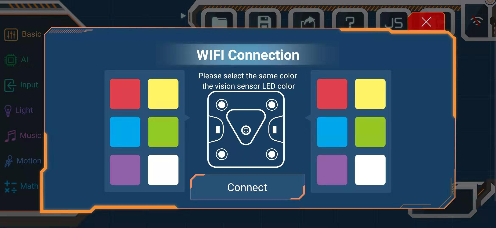
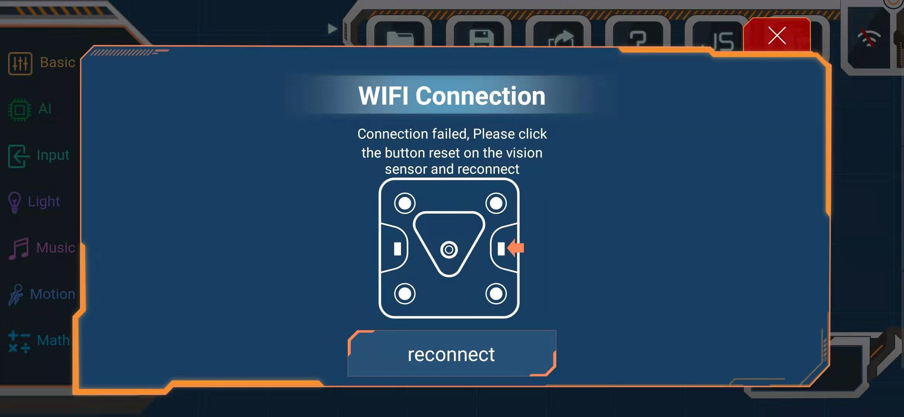
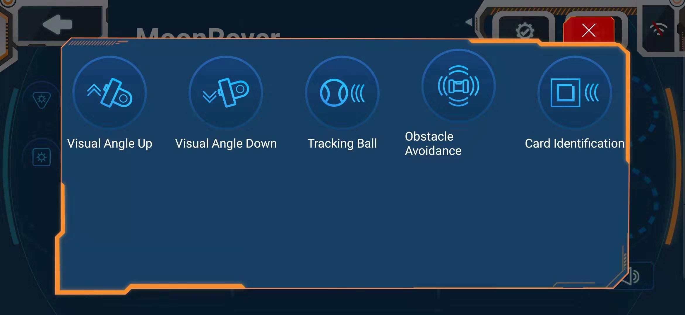
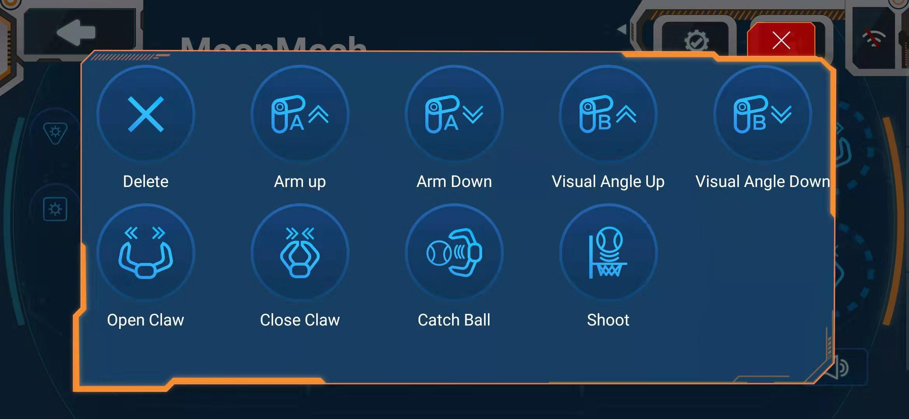
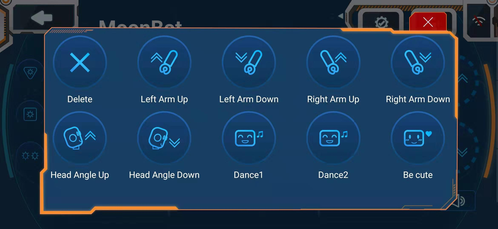
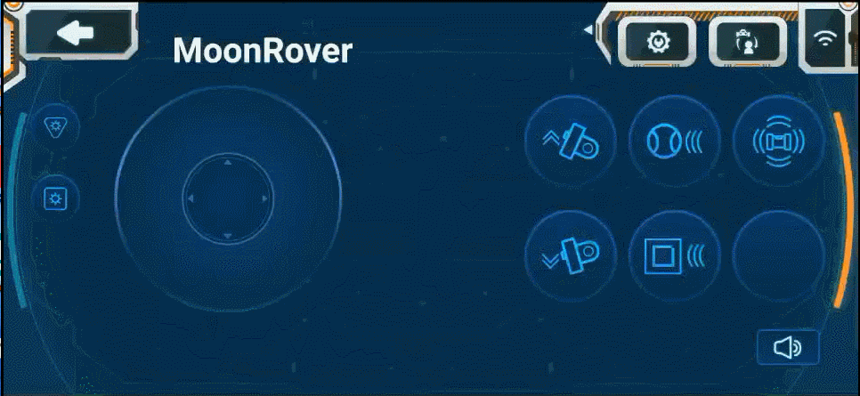

# APP Remote Contorl

First entry into APP controller, chooses the corresponding configuration.

## Introduction to Controller Use

1.WiFi Conncet

Click on the combination of color blocks that match the color of the LED light of the VisionSensor to start the connection.

If the connection fails, press the visual module reset key to re-select the connection.

2.Morphological selection

Choose the corresponding form among the three construction forms.

3.Setting function Button

Click on the Setup Function Key, the circle box below the Function Key is dotted. 

Click on the dotted circle box to add, delete and replace each function into the circle box. Click on the Setup Function Key to complete the setup.

 
4.Wheel control

When WiFi is connected, the motion of the robot can be controlled by the wheel disk.

5.Functional Button

Click on the set function key to make the robot act accordingly. Some functions can be turned on/off.

MoonBotCar：Visual Angle Up/Down、Tracking Ball、Obstacle Avoidance、Card Identification

MoonBotMech：Arm up/Down、Visual Angle Up/Down、Open/Close Claw、Catch Ball、Shoot

MoonBot：Left Arm Up/Down、Right Arm Up/Down、Head Angel Up/Down、Dancer1/2、Be cute

6.LED Button and Sound Button

There will be lights/sounds when you click on the button.

## Example

