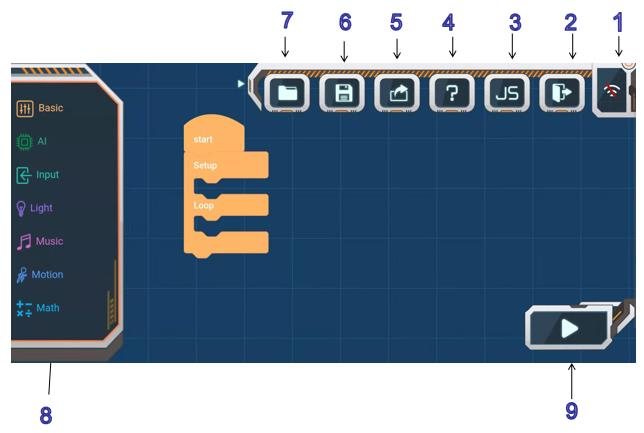

# APP Programing

## Introduction to Programming Use

1.WiFi Conncet

Click on the combination of color blocks that match the color of the LED light of the VisionSensor to start the connection.

If the connection fails, press the visual module reset key to re-select the connection.

2.Exit Button

3.The button to be updated

4.Help Button

Click on the button and there will be instructions for each button.

5.Share Button

Click to share the program with friends / QQ / Wechat / Wechat Friends Circle

6.Project Preservation Button

The program can be named and saved to my project.

7.My Program

Select your own saved project to open

8.Program Block

Contains various programming blocks

9.Play Button

Execute transmission

## Example 

