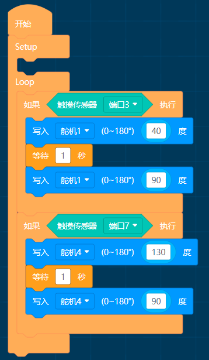
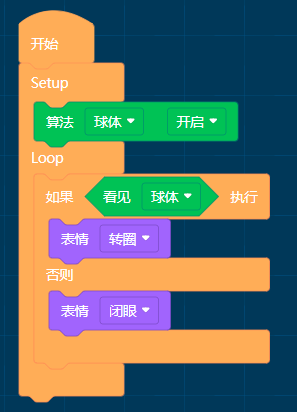
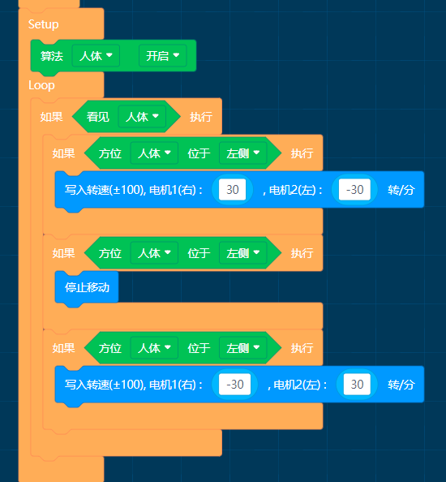
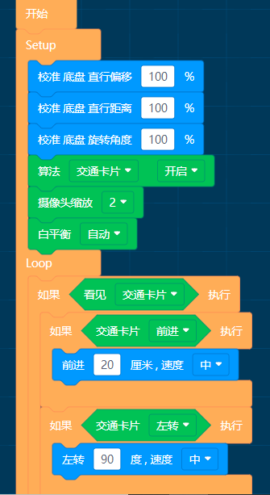

# APP示例程序

## 触摸招手

MoonBot机器人手部装有舵机，头部装有触摸传感器，可通过编程实现触摸招手

简介：循环检测触摸传感器状态，当头部左侧被触摸时，机器人招左手。当头部右侧被触摸时，机器人招右手。

## 简单算法

MoonBot机器人使用视觉传感器与眼睛灯模块

简介：循环检测球算法，当检测到球时眼睛转圈表情，未检测到时闭眼。

## 功能模块示例

MoonBot机器人使用按键扬声器LED灯舵机灯配合数学模块。

简介：循环检测按键A/B的状态，当按键被按下时，MoonBot机器人做出声音灯光手臂动作。

## 找人示例

MoonBot机器人使用视觉传感器与运动模块

简介：开启人体算法，未检测到人体时视觉传感器LED闪烁红灯，检测到时亮蓝灯。

当检测到人体位于中心时机器人停止运动，否则向左/右转动。

## 避障智能车

在智能车左右两边装上红外传感器

简介：校准底盘，当智能车右侧红外传感器检测到障碍时左转，当左侧红外传感器检测到障碍时右转，均未检测到时直行

## 交通智能车

智能车配合交通卡片算法

简介：校准底盘，开启交通卡片算法，设置摄像头缩放等级，根据灯光设置白平衡参数。

未检测到交通卡片时，视觉传感器闪烁红灯，检测到卡片时亮蓝灯。

将卡片放在智能车前，识别不同交通卡片，智能车会做出不同的运动。

 
