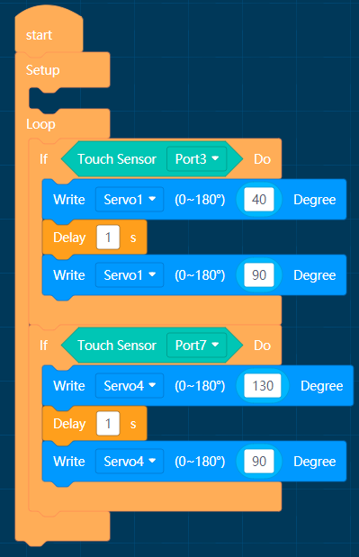
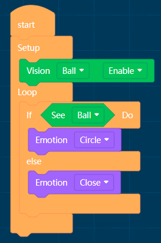
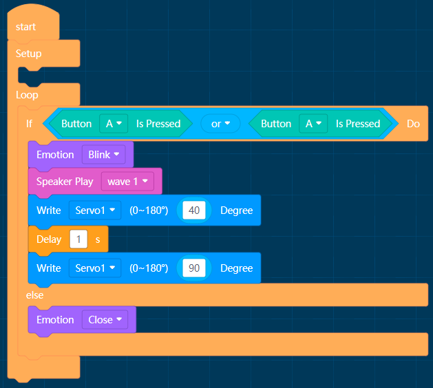
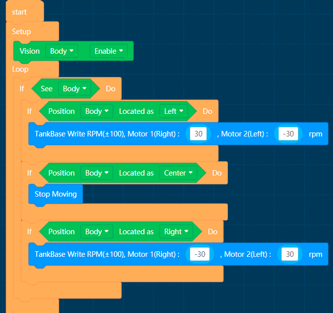
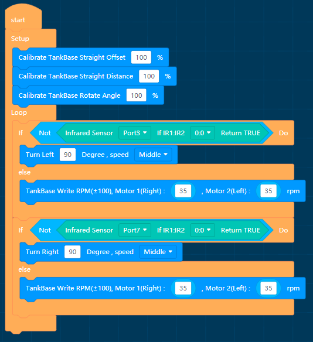
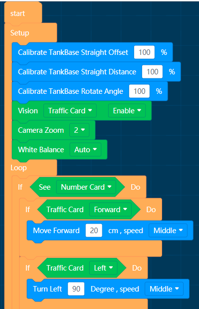
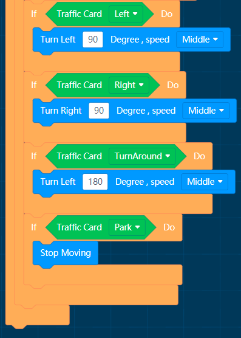

# APP Program Example

## Touch Wave

MoonBot has steering engine in its hand and touch sensor in its head. Touch beckoning can be realized by programming.

Explain:Cyclic detection of touch sensor status, when the left side of the head is touched, the robot beckons the left hand.

When the right side of the head is touched, the robot waves its right hand.

## Simple Algorithm 

MoonBot uses VisionSensor and LED Module.

Explain:Cyclic detection of the ball algorithm, when the ball is detected, the eyes turn around the expression, when not detected closed eyes.

## Examples of functional modules

MoonBot robot uses button speaker, LED lamp, actuator lamp and mathematic module.

Explain:Cyclic detection of buttonA/B status. The MoonBot robot makes sound and light arm movements when the button is pressed.

## Search sb.

MoonBot Using VisionSensor and Motion Modules

Explain: Turn on Body Detection Algorithms,When the body is not detected, the VisionSensor LED flashes red light,
 
When the body is detected, the VisionSensor LED flashes blue light.

When the body is detected in the center, the robot stops moving, otherwise it turns left/right.

## Barrier Avoidance Intelligent Vehicle

Install infrared sensors on left and right sides of intelligent vehicle car

Explain: Calibration chassis,Turn left when the right infrared sensor of the smart car detects obstacles, 

turn right when the left infrared sensor detects obstacles, and go straight when none of them is detected.

## Traffic Intelligent Vehicle

Intelligent Vehicle Cooperative Traffic Card Algorithms

Explain: Calibration chassis,turn on the traffic card algorithm, set the camera zoom level
 
and set the white balance parameters according to the lights.

When traffic card is not detected, the VisionSensor LED flashes red light and blue light when the traffic card is detected.

 
