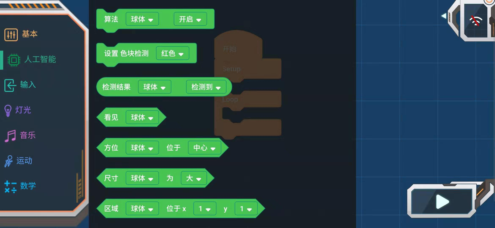
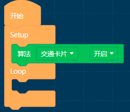
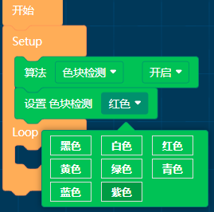
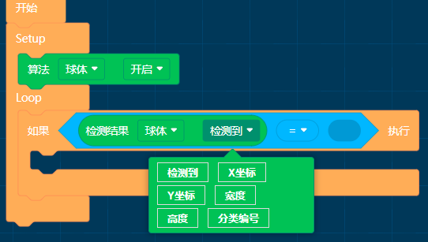
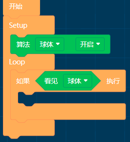
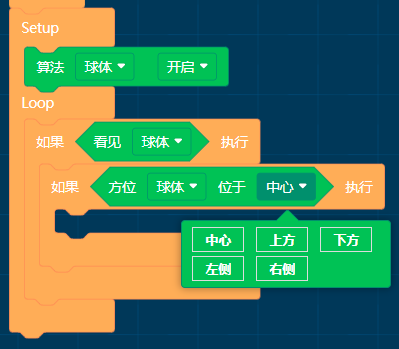

# APP编程块_人工智能

## 人工智能

### 算法开启关闭

算法：球体、人体、形状卡片、交通卡片、数字卡片、色块检测、颜色识别

参数：开启/关闭

**使用说明**

球体算法：识别橙色乒乓球(Label：1)和绿色网球（Label：2）

人体算法：检测人体的上半身特征

形状、交通、数字卡片：识别特定的卡片

色块检测：设定一种颜色，检测其色块区域

颜色识别：制定一块区域，检测其区域内的颜色 

**使用时可开启一种或同时开启多种算法**

 

### 设置色块检测颜色

颜色：黑色、白色、红色、黄色、绿色、青色、蓝色、紫色

**使用说明**

色块检测算法默认检测红色，可通过此功能块改变检测的颜色

### 读取算法检测参数

算法：球体、人体、形状卡片、交通卡片、数字卡片、色块检测

设置参数：检测到、X坐标、Y坐标、宽度、高度、分类编号

检测到：检测到时为真True,未检测到时为假False

X坐标、Y坐标、宽度、高度:量化到（0~100）

分类编号：Label值

### 看见算法

算法：球体、人体、形状卡片、交通卡片、数字卡片、色块检测、颜色识别

### 算法方位位置

算法：球体、人体、形状卡片、交通卡片、数字卡片、色块检测

参数：中心、上方、下方、左侧、右侧

### 算法尺寸大小

算法：球体、人体、形状卡片、交通卡片、数字卡片、色块检测

参数：大、中、小

### 算法区域位置

算法：球体、人体、形状卡片、交通卡片、数字卡片、色块检测

x：1/2/3/4/5

y：1/2/3/4/5

### 形状卡片

参数：对号、叉号、圆形、方形、三角形

### 交通卡片

参数：前进、左转、右转、掉头、停止

### 数字卡片

参数：0~9

### 球体识别

参数：乒乓球（橙色）、网球（绿色）

### 颜色识别

参数：黑色、白色、红色、黄色、绿色、青色、蓝色、紫色

### 检测到手势

参数：上划、下划、左划、右划、任意

### 有物体靠近小MU

参数：任意、远、中、近

### 环境光亮度

参数：很暗、暗、良好、亮、很亮

### 摄像头缩放

参数：1/2/3/4/5

**使用说明**

Zoom 值小，则视野广，距离近。Zoom 值大，则视野窄，距离远。

### 白平衡模式

参数：自动、锁定、白光、黄光

**使用说明**

自动模式：适用于光照良好且对颜色要求不高的环境中使用；

锁定模式：适用于颜色要求较高的环境，让小 MU 面对白纸进行白平衡校准，然后锁定白平衡参数，锁定后颜色不会随环境的改变而变化； 

白光模式：适合于白色灯光或者阴天环境中使用，该模式也属于自动白平衡模式； 

黄光模式：适合于黄色灯光或者阳光环境中使用，该模式也属于自动白平衡模式。

### 小MU检测时灯光设置

检测到时LED灯颜色：关闭、蓝色、绿色、青色、红色、紫色、黄色、白色、随机

未检测到时LED灯颜色：同上

灯光亮度：1~10，数值越大越亮

