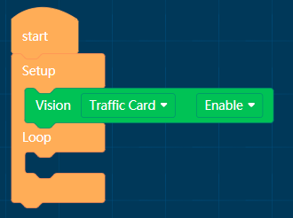
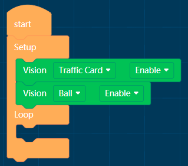

# APP Programming Block_Artificial intelligence

## Artificial intelligence

### Algorithm enable/Disable

Algorithm: ball,body, shape card, traffic card, number card, color block detection, color recognition

Parameter: enable/Disable

**Instructions**

Ball Algorithm: Identify orange ping-pong (Label:1) and green tennis (Label:2)

Body Algorithm: Detection of upper body characteristics

Shape/Trafiic/Number Card: Identify specific cards

Color block detection: Setting a color and detecting its block area

Color recognition: Specify an area to detect its color 

**One or more algorithms can be open at the same time**

 

### Setting Block Detection Colors

Color: Black, white, red, yellow, green, cyan, blue, purple

**Instructions**

The color block detection algorithm detects red by default. It can change the color of detection by using this function block.

### Reading algorithm to detect parameters

Algorithm: ball,body, shape card, traffic card, number card, color block detection, color recognition

Setting parameters: is detected, X , Y , width, height, label

is detected：True when detected and False when not detected

X coordinate, Y , width, height:Quantify to (0-100)

Classification number：Label

### Seeing algorithm block

Algorithm: ball,body, shape card, traffic card, number card, color block detection, color recognition

###  Algorithm azimuth position block

Algorithm: ball,body, shape card, traffic card, number card, color block detection

Setting parameters:center, up, down, left, right

###  Algorithm size block

Algorithm: ball,body, shape card, traffic card, number card, color block detection

Setting parameters: big, normal, small

### Algorithmic area location block

Algorithm: ball,body, shape card, traffic card, number card, color block detection

x：1/2/3/4/5

y：1/2/3/4/5

### Shape card block

Parameters: check, closs, circle, square, triangle

### Trafiic card block

Parameters: forward, left, right, turn around, park.

### Number card block

Parameters：0~9

### Ball Recognition block

Parameters: ping-pong (orange), tennis (green)

### Color recognition block

Parameters: black, white, red, yellow, green, cyan, blue, purple

### Detection of gestures block

Parameters: Up, Down, Left, Right, Any

### Something Approaching to MU block

Parameters: aany, far, middle, near.

### Ambient luminance block

Parameters: darkest, dark, good, bright, brightest

### Set camera zoom block

Parameters：1/2/3/4/5

**Instructions**

If the Zoom value is small, the field of vision is wide and the distance is close. 

If the Zoom value is large, the field of vision is narrow and the distance is long.

### White balance mode block

Parameters: auto, lock, white light , yellow light .

**Instructions**

Automatic mode: suitable for use in environments with good lighting and low color requirements

Lock-in mode: suitable for the environment with high color requirement, let MU calibrate the white balance on the white paper, 

then lock the white balance parameters, the color will not change with the change of the environment after lock-in.

White light mode: suitable for white light or overcast environment, this mode also belongs to automatic white balance mode;

Yellow light mode: suitable for use in yellow light or sunshine environment, this mode also belongs to automatic white balance mode.

### Lighting settings for MU detection

LED lamp color detected: close, blue, green, cyan, red, purple, yellow, white, random

LED lamp color undetected: ibid.

Lighting brightness: 1-10, the greater the value, the brighter