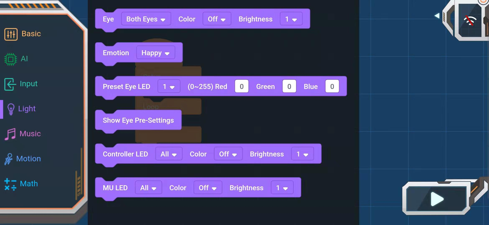
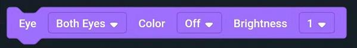
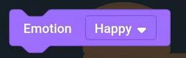
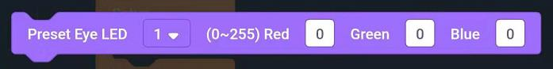
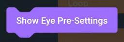
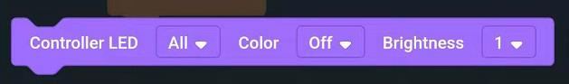

# APP Programming Block_Light

## Light

### Eye light setting block

Eye parameters: all, left and right eyes

Color parameters: close, blue, green, cyan, red, purple, yellow, white, random

Luminance parameters: 1-10, the greater the value, the brighter

### Expression block

Parameters: happy, sad, angry, blink, turning, flashing, rainbow, closed eyes

Return: Show expression

### Eye preset RGB value of each LED lamp

LED light：1-12 and all lights

Red：0~255

Green：0~255

Blue：0~255

### Show eye preset

### Main control LED lamp setting block

Main LED parameters: all, 1, 2

Color parameters: close, blue, green, cyan, red, purple, yellow, white, random

Luminance parameters: 1-10, the greater the value, the brighter

### MU LED light setting block

MU LED lamp parameters: all, 1, 2

Color parameters: close, blue, green, cyan, red, purple, yellow, white, random

Luminance parameters: 1-10, the greater the value, the brighter