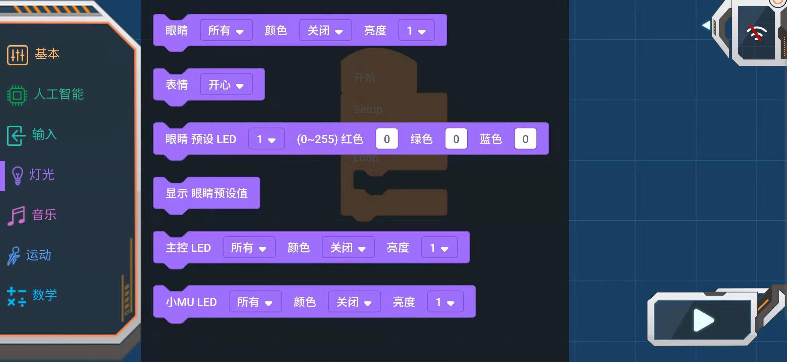

# APP编程块_灯光

## 灯光

### 眼睛灯光设置块

眼睛参数：所有、左眼、右眼

颜色参数：关闭、蓝色、绿色、青色、红色、紫色、黄色、白色、随机

亮度参数：1~10，数值越大越亮

### 表情块

参数：开心、悲伤、生气、眨眼、转圈、闪烁、彩虹、闭眼

返回:显示表情

### 眼睛预设各LED灯RGB

LED灯：1~12及所有灯

红色：0~255

绿色：0~255

蓝色：0~255

### 显示眼睛预设值

### 主控LED灯设置块

主控LED参数：所有、1、2

颜色参数：关闭、蓝色、绿色、青色、红色、紫色、黄色、白色、随机

亮度参数：1~10，数值越大越亮

### 小MU LED灯设置块

小MU LED灯参数：所有、1、2

颜色参数：关闭、蓝色、绿色、青色、红色、紫色、黄色、白色、随机

亮度参数：1~10，数值越大越亮

