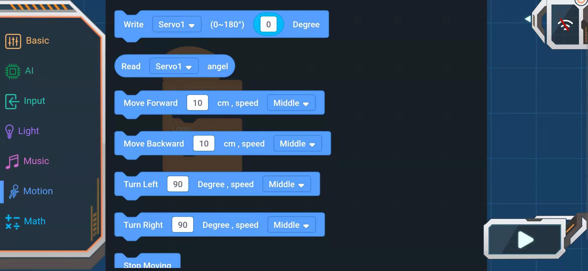
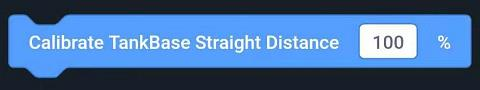

# APP Programming Block_motion

## motion

### Setting steering angle block

Steering port：steering1~steering4

Angle：0~180°

### Read steering angle block

Read the specified steering angle

Parameters: steering gear 1-4

### Forward

Distance set to advance at specified gear speed

Execution distance：0~999cm

Speed parameters: very fast, fast, medium, slow, very slow

### Back off

Back-set distance at specified gear speed

Execution distance：0~999cm

Speed parameters: very fast, fast, medium, slow, very slow

### Turn Left

Turn left at the specified gear speed and set the angle

Execution angle：0~999°

Speed parameters: very fast, fast, medium, slow, very slow

### Turn right

Turn right at the specified gear speed and set the angle

Execution angle：0~999°

Speed parameters: very fast, fast, medium, slow, very slow

### Stop Motion block

### Writing speed of Motor block

Write a certain speed to the motor（-100~+100R／min）

Parameters: Motor 1, Motor 2

### Read motor speed block

Parameters: Motor 1, Motor 2

### Calibration of alignment migration block

Calibrate the alignment migration so that it does not migrate in a certain direction.

Parameters: 0-200, > 100 to the right and < 100 to the left

### Calibration of alignment distance block

Calibrating the inaccuracy of the direct distance caused by external interference

Parameters: > 100 Increase Distance, < 100 Reduce Distance

### Calibration of turning angle block

Incomplete turning angle caused by calibration external interference

Parameters: > 100 Increase turning angle, < 100 Reduce turning angle

### Calibration of steering angle block

Calibration of angle error in production and installation by rudder calibration module

Parameters: steering gear 1-4

Increase/decrease（-90~+90°）
