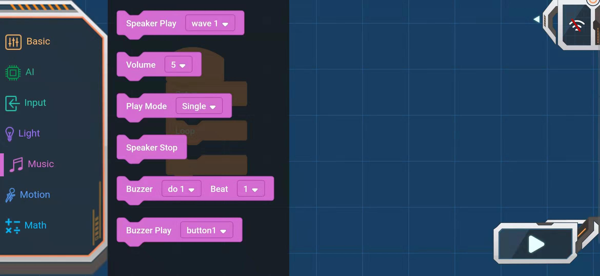

# APP Programming Block_music

## Music

### Speaker Plays Sound block

Play the specified sound：Animal Voice, Greetings, Piano, City, Drum, Custom Voice

### Volume Selection Block

Parameters: 0-10, the larger the value, the larger the volume.

### Play mode block

Parameters: single play, single loop

### Stop play block

Stop playing sound

### Buzzer play block

Buzzer to play scales in a set beat

Scales: aerial, do1-si7, Do1-Si7

Rhythm: 1/8-4 beats

### Buzzer play sound block

Play the specified sound

Parameters: key tone 1-4, alarm 1-2, sound effect 1-4, ambulance sound, siren sound
