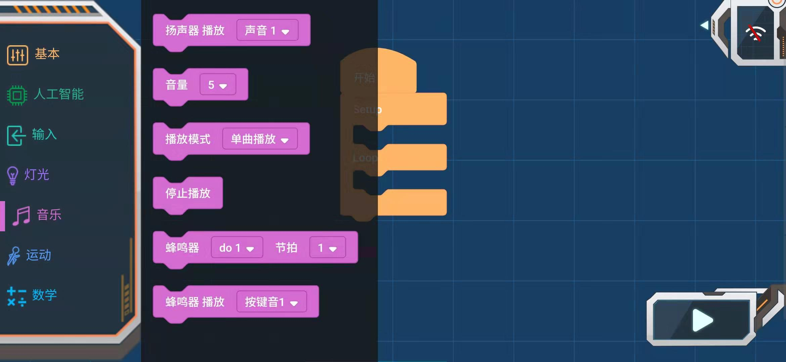

# APP编程块_音乐

## 音乐

### 扬声器播放声音

播放指定的声音

可选声音：动物声、问候语、钢琴、城市、鼓、自定义声音

### 音量选择块

参数:0~10,数值越大音量越大

### 播放模式

参数：单曲播放、单曲循环

### 停止播放

停止播放声音

### 蜂鸣器播放块

蜂鸣器以设置好的节拍播放音阶

音阶：空拍、do1-si7、Do1-Si7

节拍：1/8~4拍

### 蜂鸣器播放块

播放指定的声音

参数：按键音1-4、警报1-2、音效1-4、救护声、警笛声

