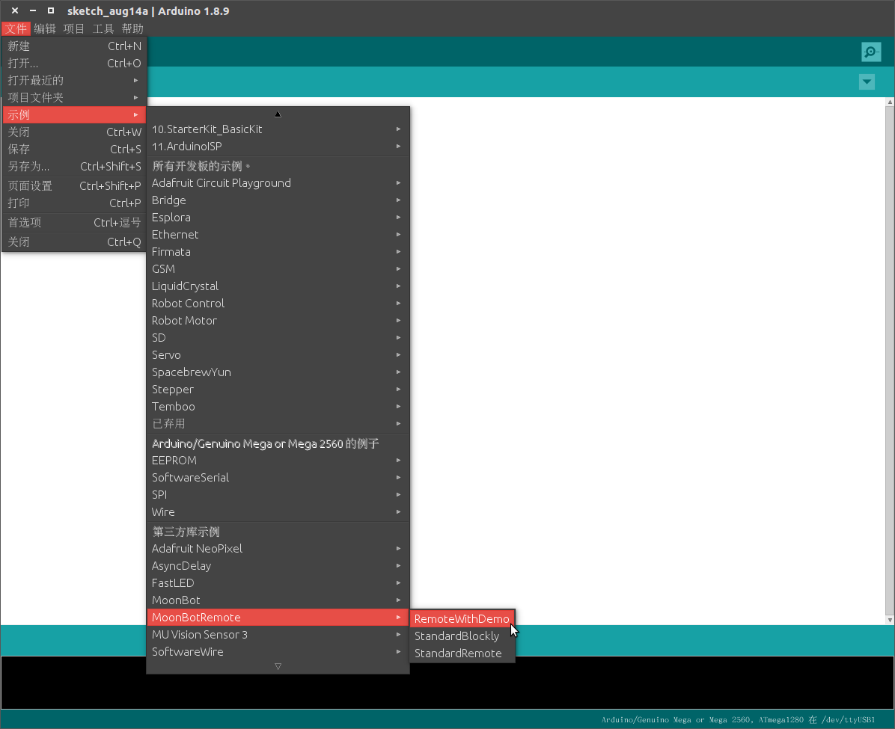

MoonBot Kit 遥控器固件升级向导
===============================

使用 MoonBot Kit 手机编程需要在主控内烧录特定的固件才可进行编程。

本文旨在指导用户如何升级 MoonBot Kit 主控模块烧录手机编程所需固件。

## 准备工作

硬件：

- MoonBot 开发者套件
- PC (Windows、Linux 或 Mac OS)

软件：

- [Arduino官方IDE](https://www.arduino.cc/en/Main/Software?setlang=cn)
- MoonBot 遥控器 Arduino 源码或固件

## 通过烧录HEX文件进行升级

- 1.下载[MoonBot 主控遥控器固件](https://github.com/mu-opensource/MoonBot_RemoteController/releases/latest)(.hex 文件)
- 2.烧录 .hex 固件
    - Windows
        ```
        1）下载 Arduino Hex 烧录工具
        2）选择 MoonBot 端口，硬件选择 `Genuino ATmega1280`
        3）点击下载，等待下载完成
        ```

## 通过Arduino IDE编译Arduino源码进行升级

- 1.搭建[MoonBot Kit Arduino 开发环境](../MoonBot_Arduino/MoonBot_arduino_development_construction_guide_cn.md)
- 2.下载[MoonBot Kit 主控遥控器源码](https://github.com/mu-opensource/MoonBot_RemoteController/releases/latest)(Source.zip 文件)
- 3.打开 Arduino IDE，点击`项目->加载库->添加.ZIP库`，选择第2步下载的.zip文件文件

    

- 4.点击确定，完成 MoonBot Kit 主控遥控器源码的加载
- 5.点击 Arduino `文件->示例->MoonBotRemote->RemoteWithDemo`，打开源码

    

- 6.连接 MoonBot Kit 主控至电脑，点击 Arduino `工具->端口`，选择对应的 MoonBot 端口
- 7.点击下载按钮，等待下载完成

## 测试

- 1.开机重启后按下主控上按钮A，靠近A键LED亮青色灯光并发出提示音
- 2.开机重启后按下主控上按钮B，靠近B键LED亮绿色灯光并发出提示音
