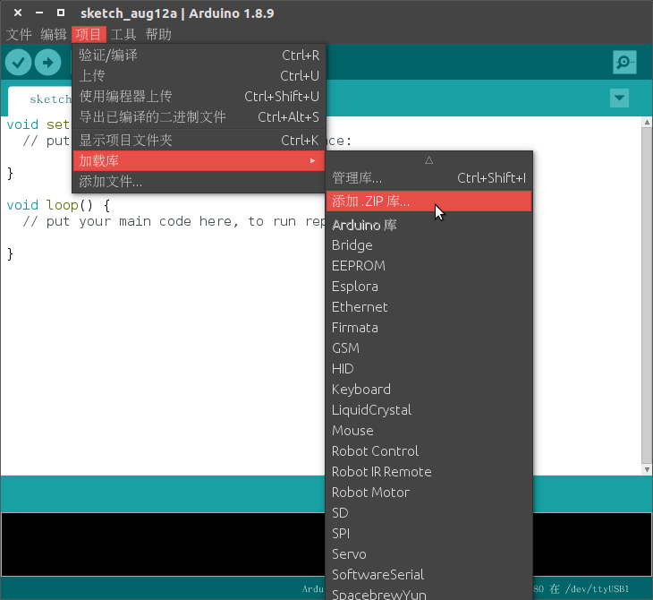

MoonBot Kit Arduino 开发环境搭建指南
============================

MoonBot Kit（以下简称 MoonBot ）提供了 Arduino 库函数，支持在 Arduino(ATmega1280) 上进行开发编程。

本文档旨在指导用户基于 Arduino 官方 IDE 进行 MoonBot 硬件开发环境搭建。

## 准备工作

硬件：

- MoonBot 开发者套件
- PC (Windows、Linux 或 Mac OS)

软件：

- [Arduino官方IDE](https://www.arduino.cc/en/Main/Software?setlang=cn)
- MoonBot Arduino 库

## 详细安装步骤

### 第一步：MoonBot Arduino外部依赖库导入

- 1.启动Arduino官方IDE
- 2.点击`项目->加载库->管理库`，打开`库管理器`

    

- 3.搜索库`AsyncDelay`，若没有安装则安装相关库，若库有更新，则进行更新

    

- 4.按照第三步的安装方法安装库`SoftwareWire` `Adafruit_NeoPixel` `Servo`，保证相关库安装到最新版

### 第二步：MoonBot Arduino库导入

- 1.在github下载最新的 [MuVisionSensor3](https://github.com/mu-opensource/MuVisionSensor3/releases/latest) 的 Arduino 库和 [MoonBot](https://github.com/mu-opensource/MoonBot/releases/latest) Arduino 库（Source code(zip)）
- 2.点击`项目->加载库->添加.zip库`，选中第一步下载的 MoonBot Arduino 库，完成库的导入

    

- 3.重复上一步，导入 MuVisionSensor3 Arduino 库，完成库导入

### 第三步：连接设备

现在连接您的 MoonBot 连接到 PC，进行设备连接和端口配置

- 1.点击`工具->开发板`，选择`Arduino/Genuino Mega or Mega 2569`。
- 2.点击`工具->处理器`，选择`ATmega1280`
- 3.点击`工具->端口`，选择对应的 MoonBot 端口

    通常，串口在不同操作系统下显示的名称有所不同：

    - **Windows 操作系统：** ``COM1`` 等
    - **Linux 操作系统：** 以 ``/dev/tty`` 开始
    - **MacOS 操作系统：** 以 ``/dev/cu.`` 开始

### 第四步：编译例程

- 1.点击`文件->示例->MoonBot`，选择其中一个例程

    

- 2.点击上传按钮，如果一切顺利，烧录完成后，开发板将会复位，对应例程会开始运行。
