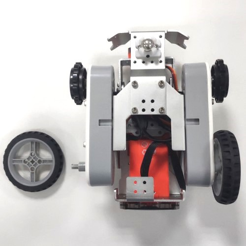
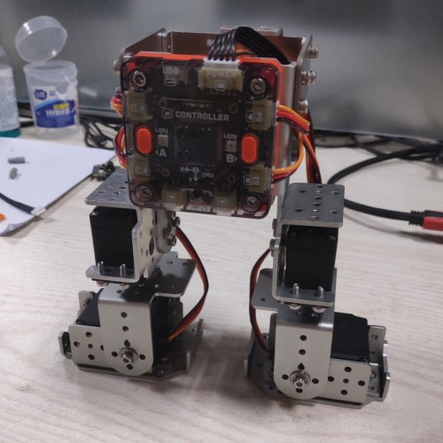
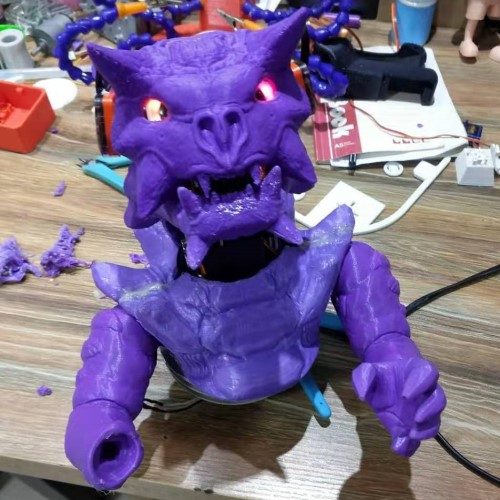

# Lego Car

Hardware modules of MoonBot Kit can be connected to lego parts and used to build lego robots.

Basic connection: There two main types of lego parts: technic series and traditional series.Horizontally placed modules are compatible with traditional series, 
while vertically placed modules are compatible with technic series. 
Traditional parts needs to be transfered to a 2X2 lego block, and technic parts needs black bolts to connected to others, as is shown below.

将电机模块主动轮的螺丝卸下，移除主动轮，换上一个TT马达转乐高的十字转接头，就可以使用乐高轮制作一个传统的两轮小车了。
在前面安装一个万向轮以支撑小车，维持水平，如图所示。换成两轮小车后速度可以达到原本履带小车的两倍以上。

# Biped Robot

MoonBot controller can be connected to 4 servos, and made a biped dancing robot with some sheet metal parts.

# Shell Mod

Shell of MoonBot can be modified by yourself.Just use 3d printing, paper and wood boards to change shell or inside parts of MoonBot.
For example, a cool dragon from Teacher Ma is shown below.

