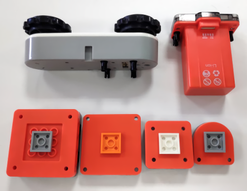

# 积木小车

MoonBot套件的硬件模块可以连接常见的乐高积木，替代钣金作为结构件搭建积木机器人。

基础连接方式：乐高积木分为传统系列和插销式的technic系列，本套件中横向放置的模块使用传统接口，纵向放置的模块使用techinc接口。
传统接口的模块需转接一块2X2的乐高块，就可以和连接到其他积木块；technic接口的模块则使用插销来连接到其他technic块,如图所示。

# 双足机器人

MoonBot主控最多可以连接4个舵机，配合钣金件可搭建一台双足跳舞机器人。
