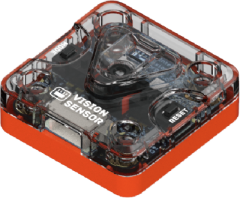
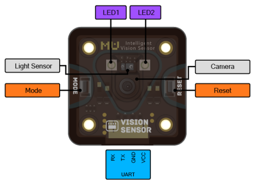
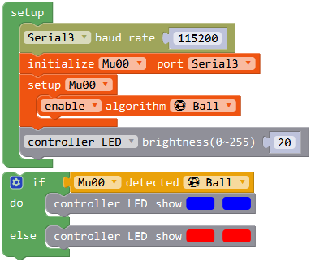
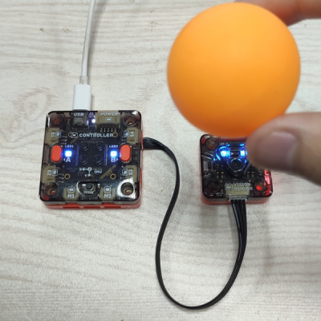

# Vision Module

## Brief Introduction

Vision module is a intelligent vision sensor containing AI algorithms.

Vision module can be connected to controller by serial interface, and controlled by pregrammed instructions.
It can also be controlled by mobile phone app through wifi.

## Specification

Size: 37 x 37 x 15 mm

Processor: ESP32

Camera: OV7725

Sight: 85°

On-board Resources: keys, LED

Communications: UART、wifi

Connector: PH2.0 4P

### Pinout

## Usage

### Serial Communication Example

Vision module can be connected to controller module and receive instructions through serial port.

Hardware connection: Connect the vision module to P9 port, as a UART3 serial port device.

Code introduction: In initial part, Serial 3 is opened and default baudrate is set to 115200.
Vision mudule is connected to serial3 and ball detect algorithm is enabled.
In loop part, Controller LEDs are set same as vison module LEDs. That is, LEDs turn blue when detected ball, and turn red when undetected.

Phenomenon: Press the reset button of vision module, wait it to be in receiving status when LEDs turn on. 
Then reset the controller,and it will send instructions to vision module.
Then the vision module is in ball detect mode, and LEDs flash red.The controller will get the data from vision module and show red too. 
When detect a ball, all LEDs turn blue.

Photo: 

Pay attention that the vison module is a little different from MU 3. Due to wifi function, vision module 
can only be connected to controller through serial port, and be developed by Arduino IDE or Mixly.The initial code is shown above.

In order to show the connect and initial progress, this program is easy. Learn more blocks and examples at

[MU 3 Mixly Programming Guide](https://morpx-docs.readthedocs.io/en/latest/MUVS3/MUVS3_Mixly/index.html)

### Connect to App through Wifi

Vision mudule contains wifi unit, so it can be connected directly to MU Bot App. Programme or remote control it, please check

[MoonBot Kit MU Bot App Tutorial](https://morpx-docs.readthedocs.io/en/latest/MoonBot/MoonBot_App/index.html)
