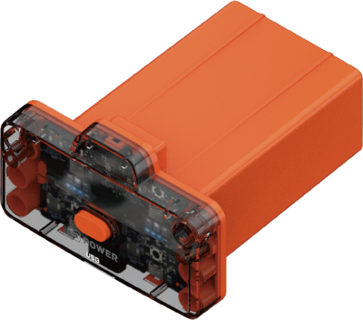
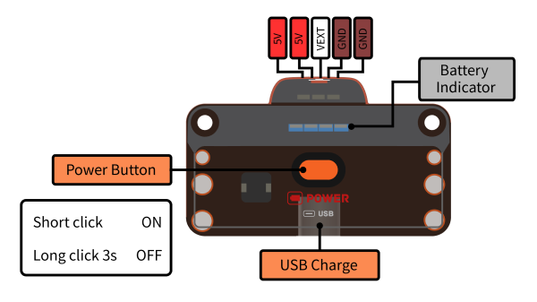

# Battery Module

## Brief Introduction

Battery module is used to power controller module, driving actuators and sensors.

It contains battery voltage converter, electricity management, overload protect and rechagre unit. It can be charged directly by USB port(Not for communication).

## Specification

Size: 67.6 x 56 x 33.7 mm

Battery Type: Polymer lithium battery

Output Power: 5V 2.8A max

Charging Power: 5V 1A max

Charging Period: 3.5h

Charging Port: USB type-C

### Pinout

## Usage

- Short press power button to turn on battery and long press 3 seconds to turn off. Automaticly turn off when unconnected for 30 seconds.

- Orange light on the top is charge indicator,while white light is power indicator and red light indicates USB connected.4 blue lights indicates remaining capacity.

- Battery module power the controller module through PH2.0 5P wire. It can drive high-power actuators like servos and motors.The max output power is 5V 2.8A.

- Battery module can be charged through USB-C port(Not for communication), with 1A max charge current.
Whole charge time is about 3.5 hours.It is recommended to use standard charger, while computer USB port can usually provide only 0.6A.

## Attention

- Battery module can only be connected to controller module.Do not modify and disassemble it.

- Battery module contains circuit protect unit to prevent overloading.Manually control the output power can maintain a longer battery lifetime.

- LiPo battery is a Flammable and explosive product, so protect it from pressure, falling, water, heat and metal parts.

- Control the remaining power to 50% for long time storage. Prevent touching the button to open it.
