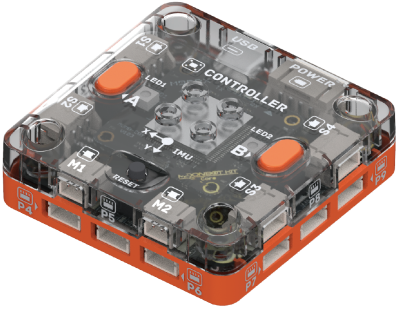
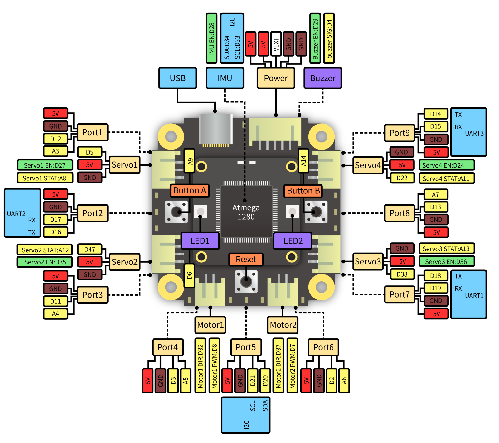
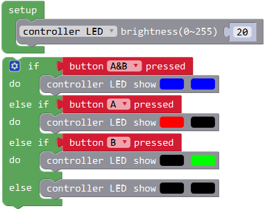
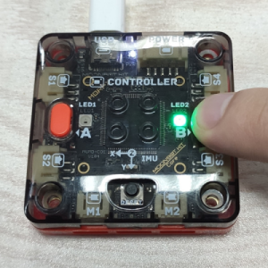
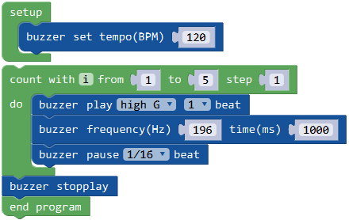
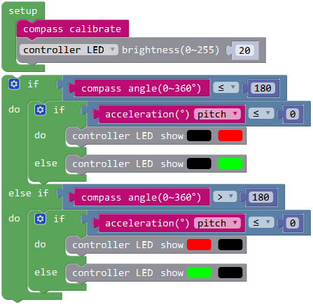

# Controller Module

## Brief Introduction

Controller Module is the programming core of the robot. The main chip is ATmega1280, which is Arduino compatible.
On-board servo, motor and GPIO ports can be used to connect to other devices. 
And there are on-board keys, LED lights, buzzer and IMU that can be used to fast programme.

## Specification

Size: 53 x 53 x 17.6 mm

Processor: ATmega1280

Ports: 4 servos, 2 motors, 9 GPIOs

On-board Resources: keys, LED, buzzer, IMU

### Pinout

## Usage

### LED and Button Example

Button and LED light are basic IO device, and can be used to test other devices.So firstly we introduce these to help test others.
The following example shows how to control 2 on-board RGB LED lights with 2 programmable buttons.

Code introduction: Loop detect the status of button A and B. LED1 turns red when button A is pressed, while LED2 turns green when button B is pressed.
When both of the buttons are pressed, both LEDs turns blue.By default, both LEDs are off.

Photo: 

### Buzzer Example

This code shows the way to programme buzzer on controller.Use two methods to make the buzzer beep.

Code introduction: Set the buzzer BPM(beats per minute) to 120, which means 1 beat is 0.5 second. 
Buzzer can directly play a tone like high G, or play a certain frequency like 194 Hz.
A delay should be added when play the frequency, or it will be skiped immediately.
Loop play 5 times and end playing.End the whole code by adding an end block or it will play repeatly.

### IMU Example

IMU(Inertial Measurement Unit) contains one or more of gyroscope, accelerator and compass. It is usually used to measure the posture of copters and robots.
This IMU on contorller contains accelerator, compass and temperature compensation. Use the feedback to know while the robot is falling, droped or shaking.

Code introduction: Initialize the compass and adjust the LEDs of controller at first. 
Loop judge the 4 directions defined by compass and accelerator and show them on LEDs.

Phenomenon: Reset the controller and draw ∞ in the air to calibrate the compass. The calibration finishs when LEDs shine.
Put the controller horizontally and 180° means the right South. yaw it to the left/right and the left/right LED turns on. Pitch up/down and LED turns green/red.

