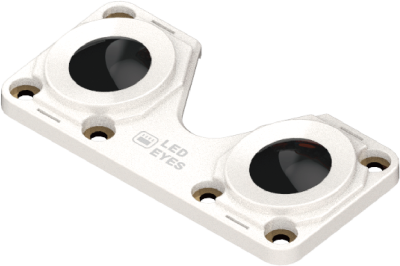
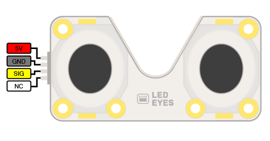
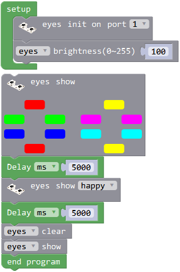
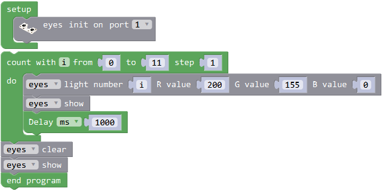

# 眼睛模块

## 简介

眼睛模块由12颗串行RGB LED组成。

## 参数

尺寸：64 x 32 x 12 mm

LED灯类型：串行LED

LED灯数量：12

颜色：1600万色

**接口图：**

## 使用示例

### 点阵控制

程序介绍：将眼睛模块连接至主控口，自定义眼睛亮度。
12颗LED灯显示程序中对应的颜色，显示5秒后眼睛做出开心的表情，显示5秒后灯光关闭。

### 单灯控制

程序介绍：LED灯从第1颗到第12颗逐颗亮起设置的RGB颜色灯，等待1秒后灯光关闭

