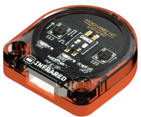
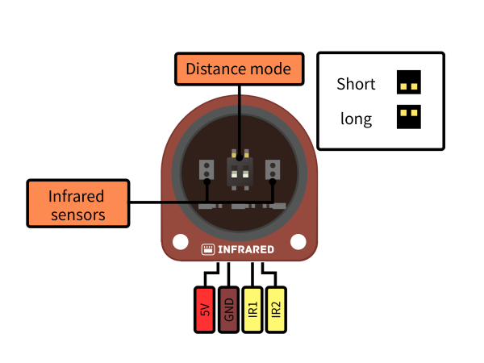
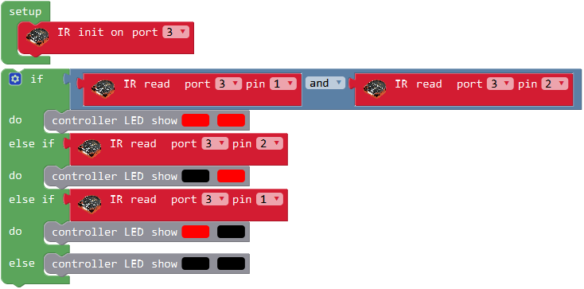
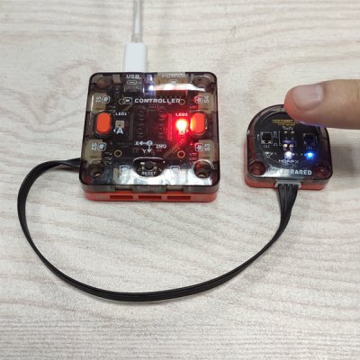

# Infrared Module

## Brief Introduction

Infrared module has 2 infrared switch inside, used to detect certain obstacle.

It has short and long modes, which can be used in following line or aoviding obstacle.

## Specification

Size: 34 x 32 x 12 mm

Infrared Type: 2 reflective switchs

Detect Distance: 

short mode 10mm

long mode 110mm

### Pinout

## Usage

Code introduction: Connect the infrared module to P3 of controller module and detect 2 switchs state.

When both switchs detect the obstacle, 2 LEDS of controller turn red. When only one switch detect, turn on 1 LED instead.

Photo: 

