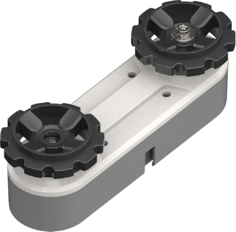
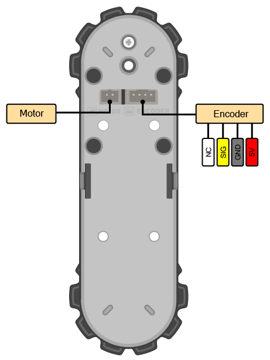
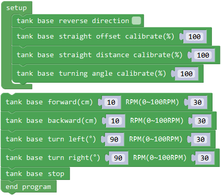
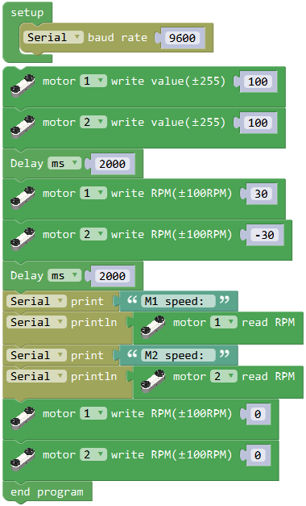

# 电机模块

## 简介

电机模块内含减速电机和测速编码器。外部有一个主动轮和一个被动轮，主动轮连接减速电机，被动轮则由螺丝和轴承连接。
轮子外接拼装式的履带，用两个电机模块即可搭出一个履带车底盘。

## 参数

尺寸：109 x 40 x 39.1 mm

减速比：120:1

空载转速：100rpm

额定转速：70rpm

额定电流：300mA

测速器：光电编码器

接口：PH2.0 2P + PH2.0 4P

**接口图：**

## 使用示例

### 底盘控制

在车形、人形、机械臂等形态下，均可直接控制电机底盘前进、后退、转弯等。通过以下程序测试底盘的运行功能。

硬件连接：将电机和测速器接到主控对应接口，电机M1对应测速器P4，电机M2对应测速器P6。
电机为大电流设备，主控必须连接电池模块供电来驱动电机。主控可同时连接电池和USB调试，此时使用电池供电。

程序介绍：初始化设定底盘的方向、校正直行偏移、距离和转弯半径。底盘可设定前进、后退、左转、右转，输入距离/角度和电机转速。最后停止程序防止循环运行。

### 电机独立控制

除了集成的底盘控制方式外，也可直接控制电机1和2。

硬件连接：同上

程序介绍：初始化打开串口，用来接收测速器数据。直接写入值通过PWM控制电机的电压，让底盘前进2秒。
然后写入带编码器测速的电机速度值，让底盘原地旋转2秒，通过串口返回测速值。通过写入转速0关闭电机，停止运行。

