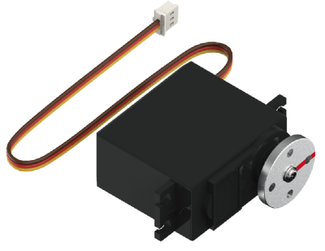
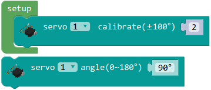
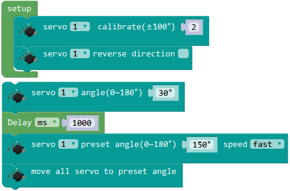

# 舵机模块

## 简介

舵机是通过PWM信号控制转动角度的执行器，内含直流电机、减速器、角度反馈和电流控制电路。

## 参数

尺寸：54 x 20 x 47.2 mm

舵机：55g金属齿轮舵机

扭矩：9.4kg.cm

可动角度：180度

工作电流：250ma

堵转电流：1A

接口：PH2.0 3P

## 使用示例

### 舵机校正

舵机转动范围为0~180度，顺时针方向为角度增大，初始角度设定为90度，舵机盘上带有一个向前的标记。

舵机为角度控制装置，通过内部电位器反馈来获得当前角度。
由于电位器角度和舵机盘安装等影响，舵机初始角度可能会有较小的偏差，通常小于10度，可通过程序来校正舵机的初始角度。

程序介绍：初始化设定舵机角度校正，将舵机转至90度，观察实际舵机盘角度是否有偏差，调整校正角度值确定该舵机的校正角度。
注意校正角度值为舵机的初始值而不是端口S1的初始值。如果将该舵机换端口则需要将程序中也改为对应端口。

### 舵机转动

舵机转动有两种方式，设定转至角度和时间，或者预设角度和速度后同步移动。前一种方式通常用于单舵机转动，后一种方式用于多个舵机同时转动。
通过以下示例展示两种转动方式。

程序介绍：初始化设定舵机校正角度和转动方向。循环程序先使用舵机角度和延时控制舵机转至30度，再使用同步移动方式控制舵机快速转至150度。

