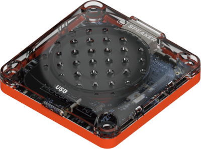
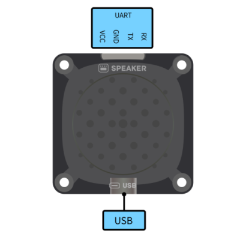
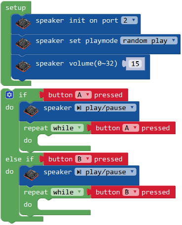

# 扬声器模块

## 简介

扬声器模块是一个通过串口指令控制的mp3模块，可连接电脑放入声音文件，通过主控控制播放。

## 参数

尺寸：48 x 48 x 11.6 mm

输出功率：1W

支持文件：mp3

存储空间：16MB

**接口图：**

## 使用示例

扬声器模块可与主控连接，通过主控控制播放。

程序介绍：让扬声器随机播放音乐，通过按键使其暂停/播放。
将扬声器连接至主控口，设置播放模式为随机播放，自定义扬声器音量大小，循环检测按键A的状态，当A被按下时，扬声器播放/暂停。

