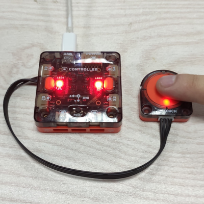

# Touch Module

## Brief Introduction

Touch module is a single touch button.

## Specification

Size: 34 x 32 x 9.6 mm

Touch Type: Non-self-locking single touch

Touch Area Size: diameter 14mm

### Pinout

## Usage

Code introduction: Connect the touch module to P1 of controller.Detect the mudule state. Controller LED turn red when touch module is touched, otherwise turn off. 

Photo: 

