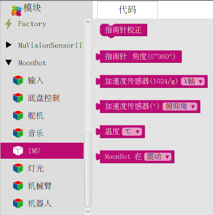

IMU
=====

**IMU** 包含了 MoonBot Kit :doc:`../../MoonBot_Hardware/MoonBot_Hardware_controller` 板载的三轴加速度，三轴磁力计和温度传感器的驱动。

通过调用这些模块，您可以获取 MoonBot Kit 主控当前方向、倾斜角度和状态等。

指南针校正
--------------

:描述:

    校准指南针，校准时主控需以”∞“字形翻转。
    
    具体可参考手机指南针校准方法。

获取指南针角度
---------------

:描述:

    读取指南针 Y 轴当前方向与正北方向的夹角。

:返回:

    - ``0~360°``

获取加速度值
---------------

:描述:

    读取给定轴的加速度模拟量。

:参数:

    :方向轴:

        - ``X,Y,Z``

:返回:

    - ``加速度模拟量``

获取加速度角度
---------------

:描述:

    获取当前主控的倾斜角度

:参数:

    :夹角类型:

        - ``俯仰角`` ：主控坐标系 Y 轴与水平面的夹角，当主控向上倾斜时，俯仰角为正，反之为负
        - ``横滚角`` ：主控坐标系 X 轴与水平面的夹角，当主控向右倾斜时，横滚角为正，反之为负

:返回:

    - ``±180°``

读取温度
--------------

:描述:

    读取当前温度值

:参数:

    :温度单位:

        - ``℃`` ：返回值以摄氏度为单位
        - ``℉`` ：返回值以华氏度为单位

:返回:

    - ``温度值``

读取当前状态
--------------

:描述:

    读取当前主控状态。

:参数:

    :状态:

        - ``震动`` ：主控是否处于震动状态
        - ``自由落体`` ：主控是否处于自由落体状态

:返回:

    - ``true`` ：主控当前处于该状态
    - ``false`` ：触控当前不处于该状态

