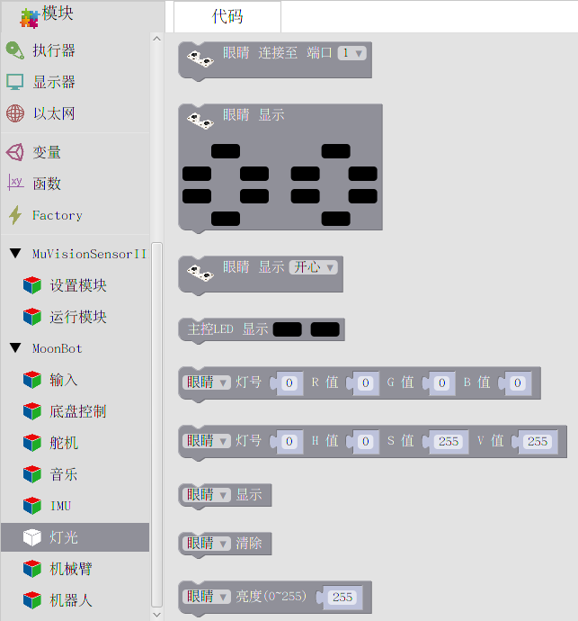
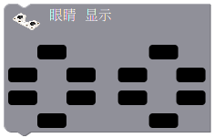
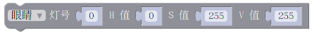
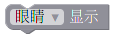
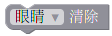
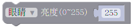

灯光
========

**灯光** 模块包含了 MoonBot Kit :doc:`../../MoonBot_Hardware/MoonBot_Hardware_controller` 板载的两颗 LED 和外接12颗 LED :doc:`../../MoonBot_Hardware/MoonBot_Hardware_eyes` 的驱动。

通过这些模块，您可以轻松地设置LED颜色和亮度。

眼睛初始化
------------

:描述:

    初始化眼睛模块至指定端口。

:参数:

    :端口:

        - ``1~9``

眼睛显示
------------

:描述:

    将眼睛 LED 颜色数值写入缓存，并显示。

:参数:

    :颜色:

        - .. image:: images/LED_color.png

眼睛显示表情
------------

:描述:

    眼睛 LED 显示表情动作。

:参数:

    :表情:

        - ``见模块下拉菜单``

主控LED显示
--------------

:描述:

    将主控 LED 颜色数值写入缓存，并显示。

:参数:

    :颜色:

        - .. image:: images/LED_color.png

LED设置RGB值
---------------

:描述:

    将 LED 给定灯号的RGB颜色数值写入缓存。

:参数:

    :LED类型:

        - ``眼睛`` ：眼睛 LED
        - ``主控LED`` ：主控 LED

    :灯号:

        - 眼睛： ``0~11``， 主控 LED ： ``0~1``

    :R 值:

        - ``0~255`` ：红色通道模拟量

    :G 值:

        - ``0~255`` ：绿色通道模拟量

    :B 值:

        - ``0~255`` ：蓝色通道模拟量

LED设置HSV值
----------------

:描述:

    将 LED 给定灯号的HSV颜色数值写入缓存。

:参数:

    :LED类型:

        - ``眼睛`` ：眼睛 LED
        - ``主控LED`` ：主控 LED

    :灯号:

        - 眼睛： ``0~11``， 主控 LED ： ``0~1``

    :H 值:

        - ``0~360°`` ：色调值

        .. image:: images/hue_color.jpeg

    :S 值:

        - ``0~255`` ：饱和度值模拟量

    :V 值:

        - ``0~255`` ：亮度值模拟量

LED显示
-----------------

:描述:

    将给定 LED 缓存内的颜色值显示出来。

:参数:

    :LED类型:

        - ``眼睛`` ：眼睛 LED
        - ``主控LED`` ：主控 LED

LED清除
----------------

:描述:

    清除指定 LED 的缓存。

:参数:

    :LED类型:

        - ``眼睛`` ：眼睛 LED
        - ``主控LED`` ：主控 LED

LED亮度
-------------

:描述:

    设置给定 LED 的亮度。

:参数:

    :LED类型:

        - ``眼睛`` ：眼睛 LED
        - ``主控LED`` ：主控 LED

    :亮度:

        - ``0~255`` ： ``0`` 为最暗，``255`` 为最亮
