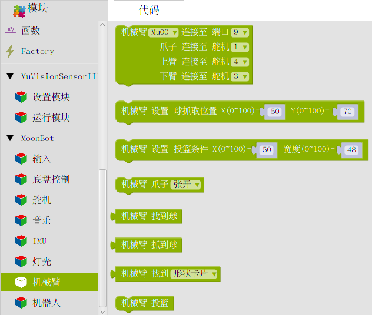

机械臂
=========

**机械臂** 包含了 :doc:`机械臂 <../../MoonBot_Structure/MoonMech_Guide_cn>` 形态下的集成动作。

通过调用这些模块，您可以轻松控制机械臂去抓球等。

初始化
--------------

:描述:

    初始化 MoonMech 机械臂端口。

:参数:

    :MU 地址:

        - ``MU00`` ：MU 地址0x60
        - ``MU01`` ：MU 地址0x61
        - ``MU10`` ：MU 地址0x62
        - ``MU11`` ：MU 地址0x63

    :MU 端口:

        - ``2,7,9``

    :机械爪舵机端口:

        - ``1~4``

    :上臂舵机端口:

        - ``1~4``

    :下臂舵机端口:

        - ``1~4``

设置抓球位置
---------------

:描述:

    设置 MoonMech 机械臂抓球位置，可以通过调整识别球的 X Y 值来让机械爪抓到球。

    当球处于给定的 X Y 值范围内时，机械爪会闭合抓取球。

:参数:

    :X:

        - ``0~100`` ：机械爪抓球时的水平位置，可通过修改此值调整机械爪抓球时相对于球的水平位置

    :Y:

        - ``0~100`` ：机械爪抓球时的垂直位置，可通过修改此值调整机械爪抓球时的垂直高度

设置投篮条件
---------------

:描述:

    设置 MoonMech 机械爪投篮的条件，可以通过调整识别到卡片的水平位置 X 和宽度来让机械臂准确的投进篮筐。

    当卡片处于给定的 X 宽度值范围内时，机械臂会触发投篮动作进行投篮。

:参数:

    :X:

        - ``0~100`` ：机械爪投篮时，相对于卡片横向坐标 X 的水平位置，可通过修改此值调整机械爪相对于卡片的水平位置

    :宽度:

        - ``0~100`` ：机械爪投篮时卡片的大小，可通过修改此值调 MoonMECH 机械臂投篮时与篮筐（卡片）的距离。

爪子动作
---------------

:描述:

    设置机械爪动作。可通过此模块控制机械爪水平平移或上下平移。

:参数:

    :动作:

        - ``张开`` ：将机械爪张开（110°）
        - ``关闭`` ：将机械爪关闭（90°）
        - ``前进`` ：机械爪水平前进一个单位
        - ``后退`` ：机械爪水平后退一个单位
        - ``向上`` ：机械爪垂直向上一个单位
        - ``向下`` ：机械爪垂直向下一个单位

找到球
-------------

:描述:

    控制 MoonMech 机械臂执行找球动作。

:返回:

    - ``true`` ：找到球
    - ``false`` ：没有找打球

抓到球
-------------

:描述:

    控制 MoonMech 机械臂执行抓球动作。
    
    诺执行此块时没有找到球机械臂会原地不动，且返回 ``false``。

:返回:

    - ``true`` ：抓到球
    - ``false`` ：没有找打球

找到卡片
-------------

:描述:

    控制 MoonMech 机械臂执行搜索篮筐（卡片）动作。

:参数:

    :卡片类型:

        - ``形状卡片``
        - ``交通卡片``
        - ``数字卡片``

:返回:

    - ``true`` ：找到给定卡片
    - ``false`` ：没有找给定卡片

投篮
-------------

:描述:

    控制 MoonMech 机械臂执行投篮动作。
    
    诺执行此块时没有找到卡片机械臂会原地不动。
