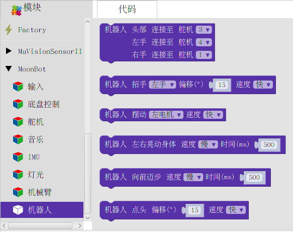
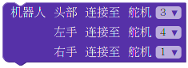

机器人
==========

**机器人** 包含了 :doc:`MoonBot 机器人 <../../MoonBot_Structure/MoonBot_Guide_cn>` 中集成的动作。

通过调用这些模块，您可以控制机器人执行点头、招手等动作。

初始化
----------

:描述:

    初始化 MoonBot 机器人各个端口。

:参数:

    :头部舵机:

        - ``1~4``

    :左手舵机:

        - ``1~4``

    :右手舵机:

        - ``1~4``

招手
----------

:描述:

    驱动机器人的手臂进行招手。

:参数:

    :手臂:

        - ``左手``
        - ``右手``
        - ``双手``
    
    :偏移:

        - ``0~90`` ：机器人上下招手偏移角度

    :速度:

        - ``快``
        - ``中``
        - ``慢``

摆动
----------

:描述:

    同时摆动机器人的头和脚。

:参数:

    :电机:

        - ``左电机``
        - ``右电机``
        - ``双电机``

    :速度:

        - ``快``
        - ``中``
        - ``慢``

左右晃动身体
-----------------

:描述:

    控制机器人电机左右晃动。

:参数:

    :速度:

        - ``快``
        - ``中``
        - ``慢``

    :时间:

        - ``0～+∞`` ：电机单次晃动时间

前进迈步
-----------

:描述:

    控制机器人向前迈出一步。

:参数:

    :速度:

        - ``快``
        - ``中``
        - ``慢``

    :时间:

        - ``0～+∞`` ：电机向前迈一步的时间，时间越长，步子越大

点头
---------

:描述:

    控制机器人点一次头。

:参数:

    :偏移:

        - ``0~90°`` ：点头幅度
    
    :速度:

        - ``快``
        - ``中``
        - ``慢``

