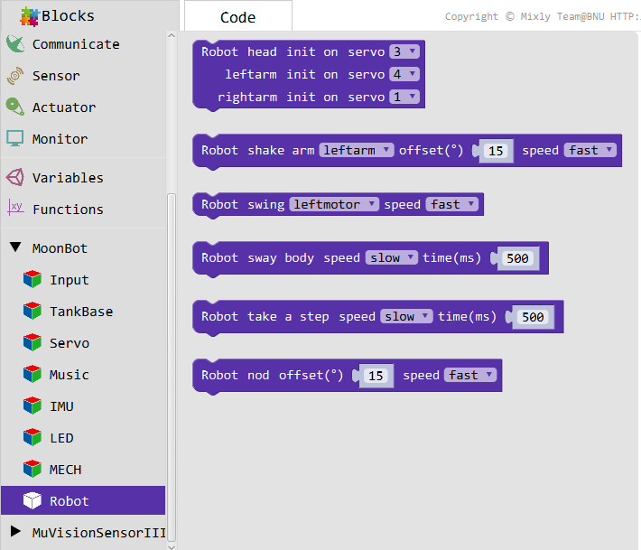
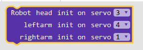
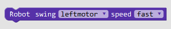
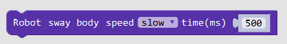
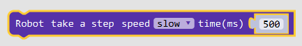
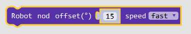

MoonBot
==========

**MoonBot** include :doc:`MoonBot robot <../../MoonBot_Structure/MoonBot_Guide_cn>` Integrative Action in Morphology.

By calling these modules, you can control the robot to perform nodding, waving and other actions.

Initialization
----------

:Introduction:

    Initialize the ports of the MoonBot robot.

:Parameters:

    :Head steering gear:

        - ``1~4``

    :Left-handed steering gear:

        - ``1~4``

    :Right-handed steering gear:

        - ``1~4``

Wave
----------

:Introduction:

    The arm that drives the robot waves.

:Parameters:

    :Arm:

        - ``Left hand``
        - ``Right hand``
        - ``Both hands``
    
    :deviation:

        - ``0~90`` :Deviation Angle of Up and Down Waves of Robot

    :Speed:

        - ``fast``
        - ``mid``
        - ``slow``

Swing
----------

:Introduction:

    The head and foot of the robot are swing at the same time.

:Parameters:

    :Motor:

        - ``Left motor``
        - ``Right motor``
        - ``Dual motor``

    :Speed:

        - ``fast``
        - ``mid``
        - ``slow``

Shake your body from side to side
-----------------

:Introduction:

    Control the robot motor to sway left and right.

:Parameters:

    :Speed:

        - ``fast``
        - ``mid``
        - ``slow``

    :Time:

        - ``0～+∞`` :Single shaking time of motor

Step Forward
-----------

:Introduction:

    Controlling the robot takes a step forward.

:Parameters:

    :Speed:

        - ``fast``
        - ``mid``
        - ``slow``

    :Time:

        - ``0～+∞`` :The longer the motor takes a step forward, the bigger the step is.

Nod
---------

:Introduction:

    The control robot nodded once.

:Parameters:

    :deviation:

        - ``0~90°`` :Nodding range
    
    :Speed:

        - ``fast``
        - ``mid``
        - ``slow``

