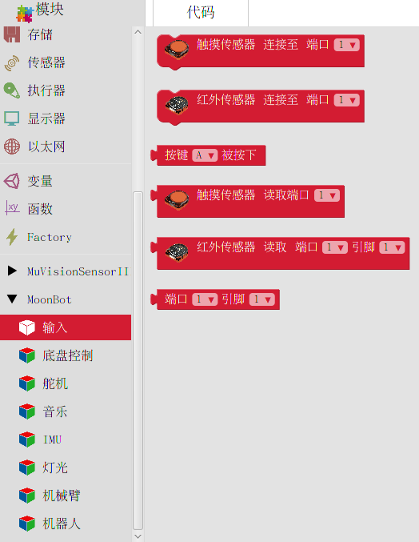

输入
====

**输入** 包含了 MoonBot Kit :doc:`../../MoonBot_Hardware/MoonBot_Hardware_touch` :doc:`../../MoonBot_Hardware/MoonBot_Hardware_infrared` :doc:`../../MoonBot_Hardware/MoonBot_Hardware_controller` 的按键及引脚映射模块

触摸传感器初始化
----------------

:描述:

    初始化触摸传感器至对应端口。

:参数:

    :端口:

        - ``1~9``

读取触摸传感器
---------------

:描述:

    读取触摸传感器对应端口的值

:参数:

    :端口: 

        - ``1~9``

:返回:

    - ``HIGH`` ：有物体触摸到触摸传感器
    - ``LOW`` ：无物体触摸到触摸传感器

红外传感器初始化
-----------------

:描述:

    初始化触摸传感器至对应端口

:参数:

    :端口: 

        - ``1~9``

读取红外传感器
---------------

:描述:

    读取红外传感器端口对应引脚的值

:参数:

    :端口:

        - ``1~9``
        
    :引脚:

        - ``1~2``

:返回:

    - ``HIGH`` ：红外传感器被触发
    - ``LOW`` ： 红外传感器没有被触发

读取按键
---------

:描述:

    读取按键状态

:参数:

    :按键: 

        - ``A`` ：按键A
        - ``B`` ：按键B
        - ``A&B`` ：按键A和B

:返回:

    - ``HIGH`` ：按键被按下
    - ``LOW`` ：按键没被按下

端口引脚映射
-------------

:描述:

    读取 MoonBot 端口对应的 Arduino 引脚号

:参数:

    :端口: 

        - ``1~9``

    :引脚:
    
        - ``1~2``

:返回:

    - ``对应的Arduino引脚``
