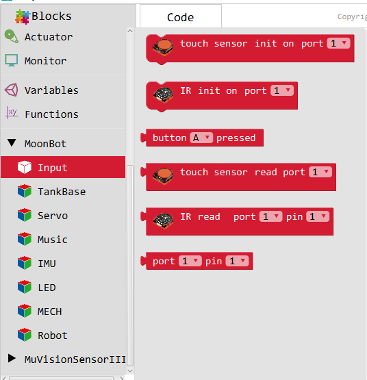
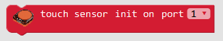
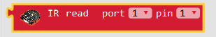
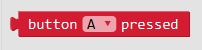
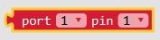

Input
====

**Input** include MoonBot Kit :doc:`../../MoonBot_Hardware/MoonBot_Hardware_touch` :doc:`../../MoonBot_Hardware/MoonBot_Hardware_infrared` :doc:`../../MoonBot_Hardware/MoonBot_Hardware_controller` keys and pin mapping module

Initialization of Touch Sensor
----------------

:Introduction:

    Initialize the touch sensor to the corresponding port.

:Introduction:

    :port:

        - ``1~9``

Reading Touch Sensor
---------------

.. image:: images/3.png

:Introduction:

    Read the value of the corresponding port of the touch sensor

:Parameters:

    :port: 

        - ``1~9``

:Return:

    - ``HIGH`` :Object Touch Sensor
    - ``LOW`` :Objectless Touch Sensor

Initialization of Infrared Sensors
-----------------

.. image:: images/4.png

:Introduction:

    Initialize touch sensor to corresponding port

:Parameters:

    :port: 

        - ``1~9``

Reading Infrared Sensor
---------------

:Introduction:

    Read the corresponding pin value of infrared sensor port

:Parameters:

    :Port:

        - ``1~9``
        
    :Pin:

        - ``1~2``

:Return:

    - ``HIGH`` :Infrared Sensor Triggered
    - ``LOW`` : Infrared sensor not triggered

Reading Button
---------

:Introduction:

    Read button status

:Parameters:

    :button: 

        - ``A`` :Button A
        - ``B`` :Button B
        - ``A&B``:Button A and B

:Return:

    - ``HIGH``:The Button is pressed
    - ``LOW``:The Button is not pressed

Port pin mapping
-------------

:Introduction:

    Reading the Arduino pin number corresponding to the MoonBot port

:Parameters:

    :Port: 

        - ``1~9``

    :Pin:
    
        - ``1~2``

:Return:

    - ``Corresponding Arduino pin``
