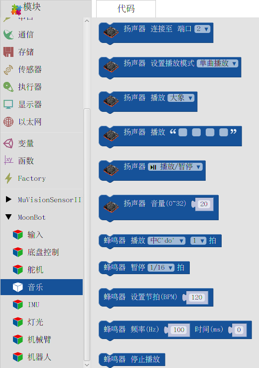

音乐
======

**音乐** 包含了 MoonBot Kit :doc:`../../MoonBot_Hardware/MoonBot_Hardware_controller` 板载蜂鸣器的驱动和外部 :doc:`../../MoonBot_Hardware/MoonBot_Hardware_speaker` 的驱动。

通过调用这些模块可以让您控制 MoonBot Kit 播放动人的音乐。

扬声器初始化
----------------

:描述:

    初始化给定端口上连接的扬声器。

:参数:

    :端口:

        - ``2,7,9``

扬声器设置播放模式
-------------------

:描述:

    设置扬声器的播放模式。

:参数:

    :播放模式:

        - ``单曲播放`` ：播放指定音乐后停止播放
        - ``单曲魂环`` ：循环播放指定音乐
        - ``播放所有`` ：播放完指定音乐后自动播放音乐列表中下一首音乐
        - ``随机播放`` ：播放完指定音乐后随机播放音乐列表中的一首音乐

扬声器播放音乐
------------------

:描述:

    播放给定名称的音乐。

:参数:

    :音乐名:

        - ：见模块对应的下拉菜单

扬声器播放自定义音乐
----------------------

:描述:

    播放给定音乐名称的音乐。

    该操作前用户需往扬声器内存入对应的自定义音乐（ :doc:`如何存入音乐？ <../../MoonBot_Hardware/MoonBot_Hardware_speaker>`），音乐名前四字需为字母或数字。

:参数:

    :音乐名:

        - ：自定义音乐名称的前4个字符，只支持 **英文** 或 **数字**

扬声器播放设置
----------------

:描述:

    设置当前扬声器播放状态。

:参数:

    :播放设置:

        - ``播放/暂停`` ：播放或暂停当前音乐
        - ``下一首`` ：播放音乐列表中下一首音乐
        - ``上一首`` ：播放音乐列表中上一首音乐
        - ``停止`` ：停止播放音乐

扬声器设置音量
-----------------

:描述:

    设置扬声器音量。

:参数:

    :音量:

        - ``0~32``

蜂鸣器播放音阶
-----------------

:描述:

    蜂鸣器以给定音阶播放给定节拍的时间。

:参数:

    :音阶:

        - ``高中低三阶``

    :节拍:

        - ``1/16~4拍`` ：单节拍时间可通过 ``蜂鸣器设置播放节拍`` 设置

蜂鸣器暂停播放
------------------

:描述:

    蜂鸣器暂停播放给定节拍的时间。

:参数:

    :节拍:

        - ``1/16~4拍`` ：单节拍时间可通过 ``蜂鸣器设置播放节拍`` 设置

蜂鸣器设置播放节拍
--------------------

:描述:

    设置蜂鸣器每分钟节拍数（BPM）。

:参数:

    :每分钟节拍数:

蜂鸣器播放频率
----------------

:描述:

    设置蜂鸣器以给定频率播放给定时间的音乐。

:参数:

    :频率:

        - ``0~65535`` ：频率推荐设置在人耳所能接受的频率范围（20～20000Hz）

    :时间:

        - ``0`` ：持续播放
        - ``其他`` ：播放指定长度的时间后停止

蜂鸣器停止播放
-----------------

:描述:

    蜂鸣器停止播放声音。

