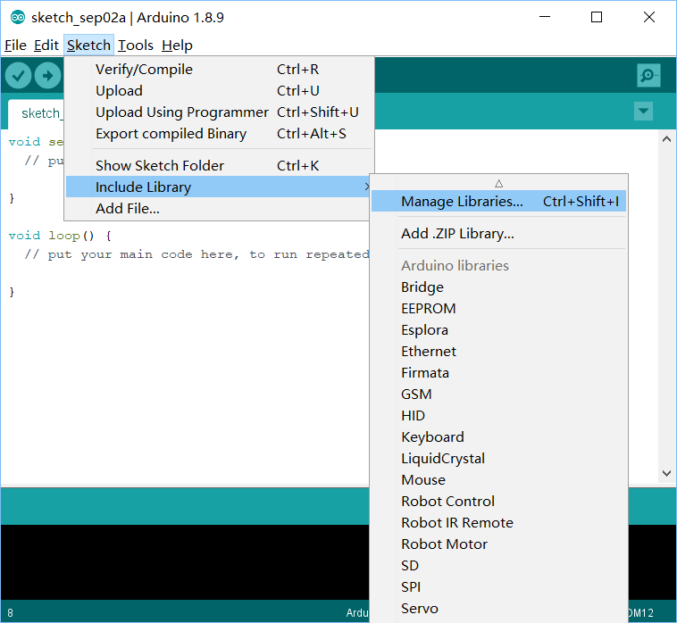
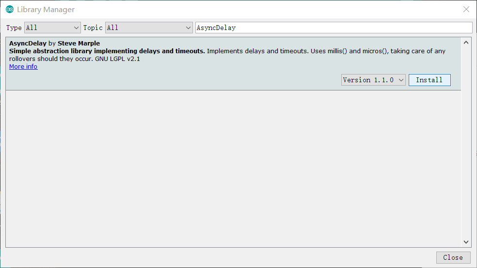

# MoonBot Mixly Guidelines for Programming Construction

There are two ways to install MoonBot Mixly. Download the full package and unzip, or install independent library if you already installed Mixly.

Instructions are shown below.

## Full Installation Package Download

Windows/Linux/Mac Full Edition MoonBot Mixly Package Download Link: <https://drive.google.com/drive/folders/1L_FKMlQnddgi_rLnRiOYbA9o9q24RGEm?usp=sharing>

## Independent Library Installation

### Import and upgrade Mixly-Arduino Library

- 1.Start Mixly-Arduino
    - Windows

        Open `{your_mixly_path}/arduino-1.8.5/arduino.exe`file under the Mixly installation path，start Arduino

    - Linux

        Running Arduino files at the terminal,start Arduino
        ```bash
        $ cd {your_mixly_path}
        $ ./arduino-1.8.2-linux64/arduino
        ```
- 2.Click on `Project - > Load Library - > Manage Library', open  `Library Manager'.`

    

- 3.Search library `AsyncDelay`, install the relevant library if not installed and update if the library is not the latest edition

    

- 4.Install the library `Software Wire ``Adafruit_NeoPixel `Servo'according to the installation method of the third step,
    ensure that the relevant library is installed to the latest version.
	
- 5.Close Arduino,Complete the installation of the base library.

### Import Mixly Library

- 1.Click Download [MoonBot](https://github.com/mu-opensource/MoonBot-Mixly/releases/latest)/[MuVisionSensor3](https://github.com/mu-opensource/MuVisionSensor3-Mixly/releases/latest) The latest version of Mixly Library Compression Pack
- 2.Upzip the downloaded `MoonBot/MuVisionSensor3`compression package
- 3.Open the Mixly interface, click the import button,find the files at the end of `xml`under the `MoonBot/MuVision Sensor 3` folder path.
- 4.Library installation completed
