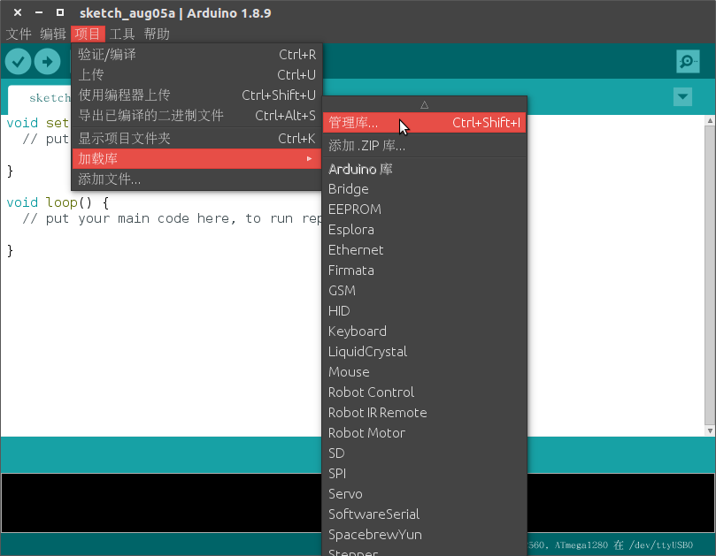
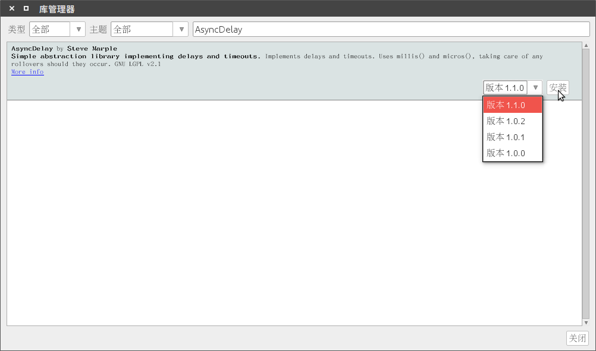

MoonBot Mixly 编程搭建指南
=======================

## 完整安装包下载

Windows/Linux/Mac完整版MoonBot Mixly安装包下载地址：[https://pan.baidu.com/s/1h8Cuj8UYm99Mh3O1ppmMfg](https://pan.baidu.com/s/1h8Cuj8UYm99Mh3O1ppmMfg)，提取码：`ksme`

## 独立库安装

### 导入、升级Mixly-Arduino库

- 1.启动Mixly下Arduino
    - Windows

        打开Mixly安装路径下`{your_mixly_path}/arduino-1.8.5/arduino.exe`文件，启动Arduino

    - Linux

        在终端运行路径Mixly安装路径下Arduino文件，启动Arduino
        ```bash
        $ cd {your_mixly_path}
        $ ./arduino-1.8.2-linux64/arduino
        ```
- 2.点击`项目->加载库->管理库`，打开`库管理器`

    

- 3.搜索库`AsyncDelay`，若没有安装则安装相关库，若库有更新，则进行更新

    

- 4.按照第三步的安装方法安装库`SoftwareWire` `Adafruit_NeoPixel` `Servo`，保证相关库安装到最新版
- 5.关闭Arduino，完成基础库安装

### 导入Mixly库

- 1.点击下载[MoonBot](https://github.com/mu-opensource/MoonBot-Mixly/releases/latest)/[MuVisionSensor3](https://github.com/mu-opensource/MuVisionSensor3-Mixly/releases/latest)最新版Mixly库压缩包
- 2.解压已下载的`MoonBot`/`MuVisionSensor3`压缩包
- 3.打开Mixly界面，点击导入按钮，分别在刚解压出的`MoonBot`/`MuVisionSensor3`文件夹路径下找到`.xml`结尾的文件
- 4.至此，库安装完成
