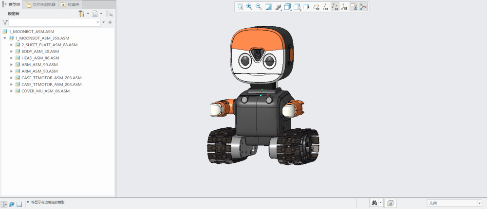

# Technical Information

Thanks for purchasing MoonBot Kit, and we would like to provide continuous updating service, please check to our website: www.morpx.com regularly. 
Updates are subject to change without notice. You can get the latest technical information from the following websites:

Official Website: <http://mai.morpx.com/page.php?a=moonbot-kit>

GitHub: <https://github.com/mu-opensource/>

# 3D Assembly Models

MoonBot Kit 3D assembly files can be downloaded here: 

[MoonBot Kit 3D assembly](https://github.com/mu-opensource/Morpx-docs-en/raw/master/MoonBot/MoonBot_Resource/sources/MoonBot_Kit_asm.zip) 

STP file is a universal 3D file format, which can be opened by popular CAD software like solidworks and CREO. 

The models can be used to watch the details of each MoonBot Kit structure, measure dimension, render in Keyshot and so on.

Plastic and sheet metal parts in models are optimized for manufacturing, and are not recommended to be used for FDM 3D printing. 

# Platform Links

MoonBot Kit is compatible with Arduino opensource platform. Check related website to learn basic knowledge.

**Mixly**

Mixly Official Website: <http://mixly.org/>

**Arduino**

Arduino Official Website: <https://www.arduino.cc/>
