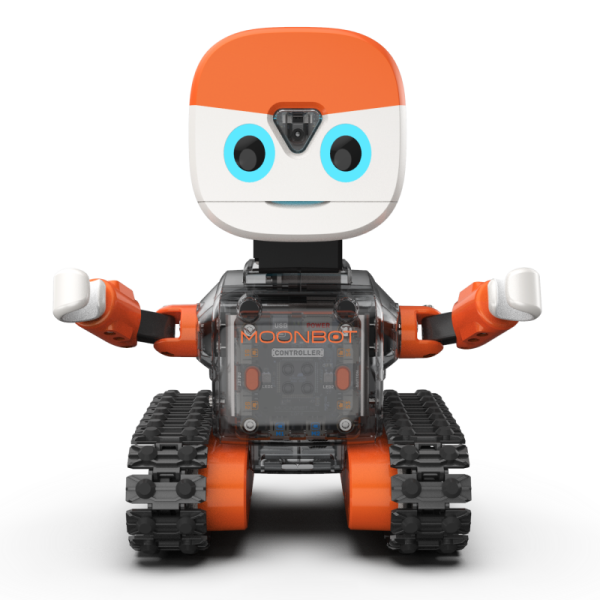
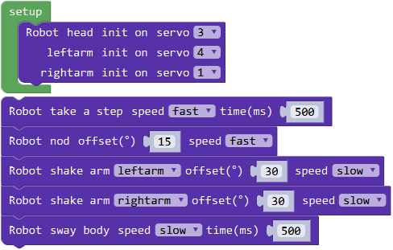
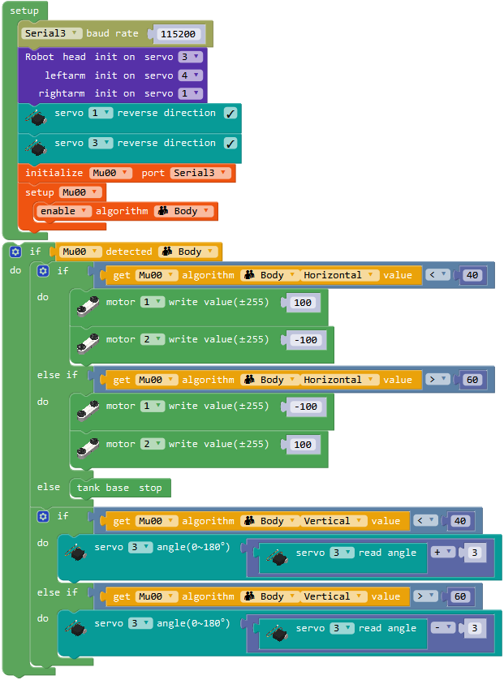

# MoonBot 指南

## 介绍

MoonBot是一台具有丰富的传感和交互的半人形机器人。主体由钣金骨架配合塑料外壳搭建而成，使用履带底盘整体移动，头部、手部则使用舵机实现转动。
通过触摸、视觉、方位的反馈，眼睛和扬声器等都可作出交互。

MoonBot可用于学习接待、巡逻等服务型机器人应用。

## 参数

尺寸：150 x 137 x 216 mm

功能

动作：头部 手臂 底盘

交互：眼睛 喇叭

传感：视觉 触摸 测速

## 搭建指南

下载MoonBot pdf搭建指南

[MoonBot 搭建指南](https://github.com/mu-opensource/Morpx-docs/raw/master/MoonBot/MoonBot_Structure/docs/MoonBot_manual.pdf)

## 示例程序

下载MoonBot米思奇示例程序

[MoonBot 示例程序](https://github.com/mu-opensource/Morpx-docs/raw/master/MoonBot/MoonBot_Structure/sources/Mixly_example_MoonBot.zip)

### 摇摆身体

MoonBot的手部和脖子有舵机，履带底盘用电机模块驱动，可通过编程实现相应的动作。通过一个简单的示例让MoonBot活动一下。

程序介绍：初始化设定头和手部的舵机端口，循环程序里一次使用机器人动作块，让机器人左手右手一个慢动作。

### 跟随人体

MoonBot可以靠视觉来识别人体，并通过底盘和头部的运动跟随人体。

程序介绍：初始化连接舵机，根据实际转动方向调整舵机的方向，设置连接在串口3的视觉传感器，启用人体识别算法。
循环程序中，当检测到人体时，根据人体的横向坐标判断底盘的转动方向，再根据人体的纵向坐标判断脖子舵机的转动方向。

实验现象：烧录完成程序后打开MoonBot放在桌面上，站在机器人眼前，当视觉闪红灯时未检测到，当视觉闪蓝灯时则检测到人体。
人上下左右移动时机器人也会移动和转动脖子，保持脸始终朝向人体。

