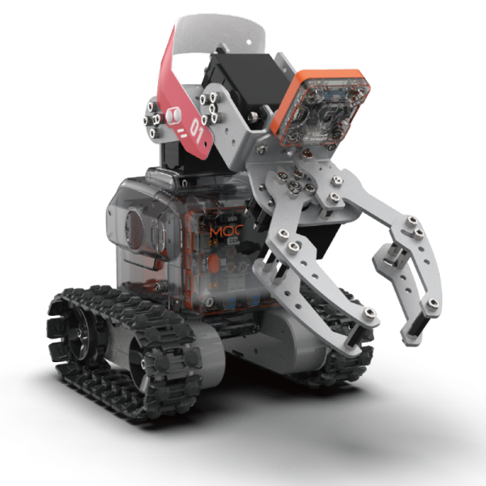
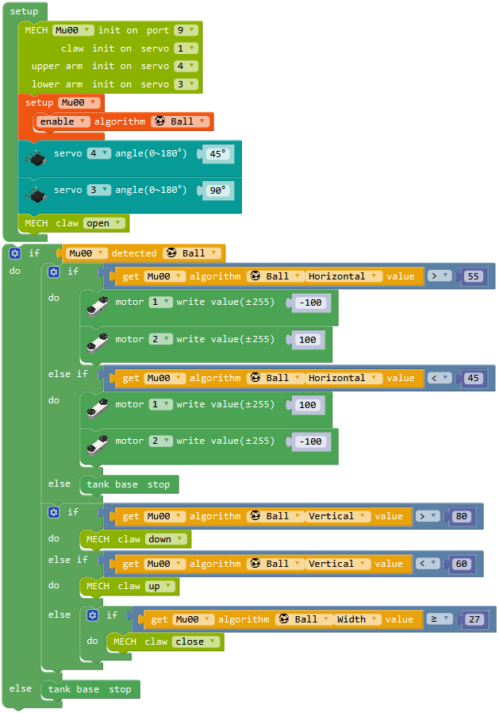

# MoonMech 指南

## 介绍

MoonMech是一台可移动的机械臂。底盘和人型类似，由塑料外壳包裹钣金骨架搭建而成。整体移动依靠底部履带底盘，机械臂的角度和调节则依靠两个舵机。前置机械爪配合视觉反馈可以夹持各种物体。

MoonMech可以用于学习物料搬运、投篮等工程和竞技类应用。

## 参数

尺寸：271 x 137 x 244 mm

功能

动作：机械臂 机械爪 底盘

传感：视觉 测速

## 搭建指南

下载MoonMech pdf搭建指南

[MoonMech 搭建指南](https://github.com/mu-opensource/Morpx-docs/raw/master/MoonBot/MoonBot_Structure/docs/MoonMech_manual.pdf)

## 示例程序

### 抓球机器

本示例介绍机械臂通过视觉识别抓取乒乓球。

程序介绍：初始化设定MU和舵机的连接口，视觉启用球检测算法，舵机运动到初始位置。循环程序中视觉检测到球，则判断球的横向坐标，底盘左右移动；判断球的纵向坐标，
爪子上下移动。以球的宽度估计距离，当球宽度大于或等于27时则机械爪抓取，就可以抓到球。

实验现象：打开机械臂后机械爪朝前张开，视觉闪红灯开始检测。将乒乓球放在机械爪前方，视觉识别到时闪蓝灯，调整球到爪子抓取范围时机械爪会自动抓取。

