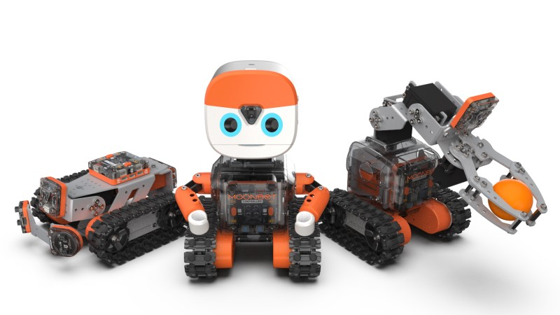
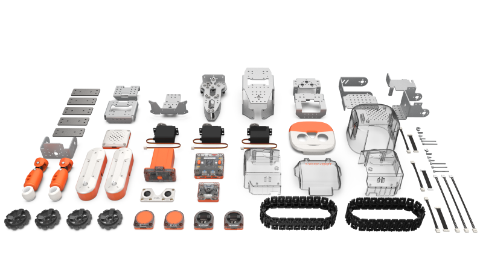

.. morpx documentation master file, created by
   sphinx-quickstart on Fri Jul 19 17:00:19 2019.
   You can adapt this file completely to your liking, but it should at least
   contain the root `toctree` directive.

MoonBot Kit 简介
===============================

MoonBot Kit 是摩图科技出品的一套教育套件。
产品包含多种硬件模块，配合钣金、塑料外壳等结构件可以搭建各式机器人。通过手机端、电脑端的编程软件，结合AI技术，让青少年打造人工智能机器人，学习STEAM教育的课程内容，向未来的卓越工程师迈进。

