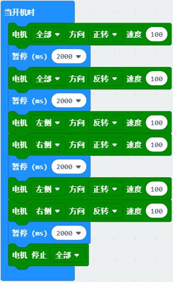
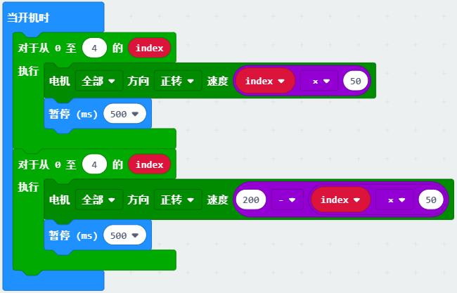
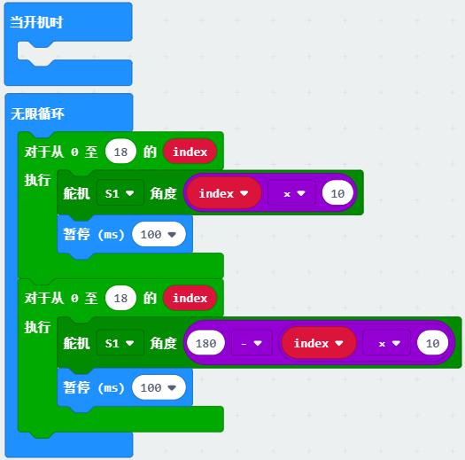
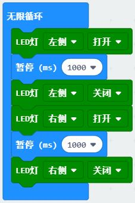
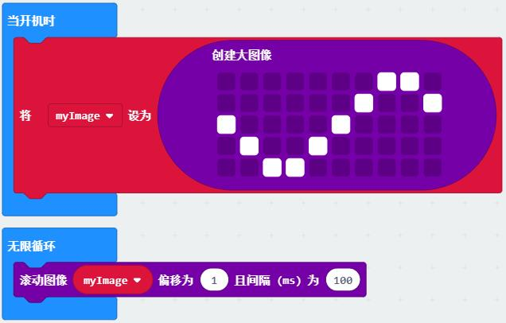
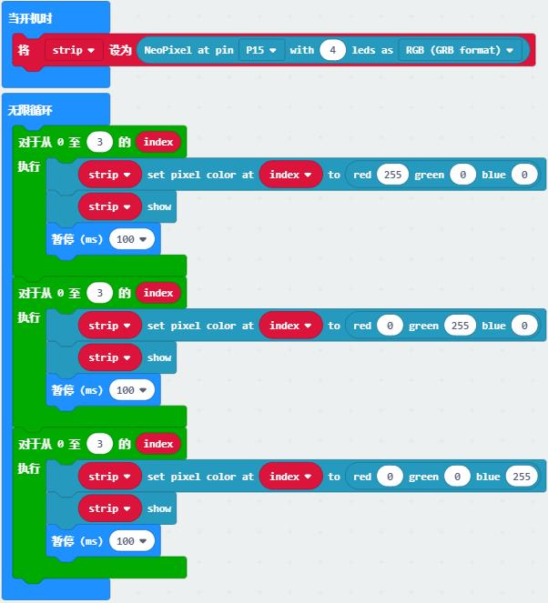
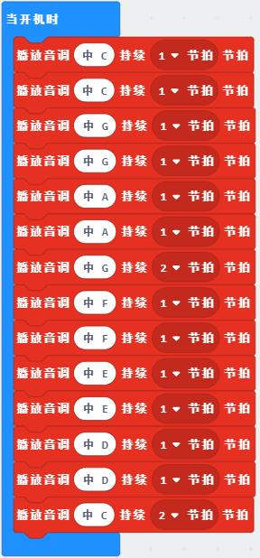

# 执行器类教程

执行器是接受控制信号并对受控对象施加控制运行作用的装置。作为输出类设备，通常用简单的从上至下的顺序控制就可以使执行器动起来。
通过相应的编程块来掌握以下执行器的直接控制。

## 电机控制

电机(motor)俗称马达，是常见的电能转换为机械能的装置。电机可划分为直流、交流，有刷、无刷，永磁、电磁等很多种类。小车常用直流减速电机作为车轮的驱动电机。
通过控制左右轮的速度、方向即可实现小车向各个方向的运动。

**示例一：控制小车运动方向**

程序说明：通过控制两个电机运动方向实现小车方向的变化，让小车分别前进、后退、左转、右转、停止，每个动作持续2秒。

**示例二：控制小车加减速** 

程序说明：使用循环控制电机速度依次增加，电机速度从0增加到200，再减到0，每次变化50.
index循环中，每执行一次index加1，index乘以相应的倍数50作为电机速度，随循环次数而变化。

## 舵机控制

舵机(servo)是一种简单的伺服电机，常用在车模、船模、机器人等产品，用于掌舵控制方向。
舵机内部采用直流电机驱动，多级齿轮减速器产生大扭矩，电位器确定当前角度。
用PWM信号控制舵机转到指定角度即可让舵机快速转到某个角度后保持不变。

**示例：控制舵机摆动** 

程序说明：循环写入舵机角度，每0.1秒改变一次角度，舵机缓慢在0-180度范围摇摆。index乘以相应的倍数作为舵机角度。

## 灯光控制

灯光是最基础的输出类设备，可作为装饰、照明、程序调试等功能。这里介绍几种不同的常用灯光和相应的控制。

### 单LED灯

麦昆小车前方有两个LED车灯，通过简单的打开和关闭控制两个灯的通断。

**示例：LED交替闪烁**

### micro:bit点阵

micro:bit自带的点阵由25个LED灯组成，可以形成丰富的图案和字符。基础示例中已展示绘制爱心，以下程序介绍LED滚动显示过程。

**示例：显示滚动图像** 

程序说明：在LED高级块中图像，创建一个大图像，在无限循环中调用，每隔200ms偏移产生滚动动画。

### 串行灯

麦昆小车车底有4个氛围灯，这是一种特殊的带芯片的串行灯，通过发送一串数据可控制整串LED的RGB值，产生各种各样的颜色。
驱动这4个灯需要添加"neopixel"扩展。
通过车底丝印可以了解这些灯的连接引脚P15和串联顺序。

**示例：流水灯** 

程序说明：通过控制每个灯的RGB值来点亮所有灯。初始化中配置灯的引脚P15，数量为4。
LED的灯号为0-3，每隔100ms依次亮红、绿、蓝灯，形成流水灯。

## 音乐控制

micro：bit的P0脚可以接蜂鸣器，制作简单的音乐。打开小车上的蜂鸣器可以启用该音乐功能。
通过编程块播放内置的音效，或者用音调自制音乐。

**示例：小星星** 

程序说明：通过编程块改变音调和节拍形成顺序的音乐段，以《小星星》的乐谱作示范。

