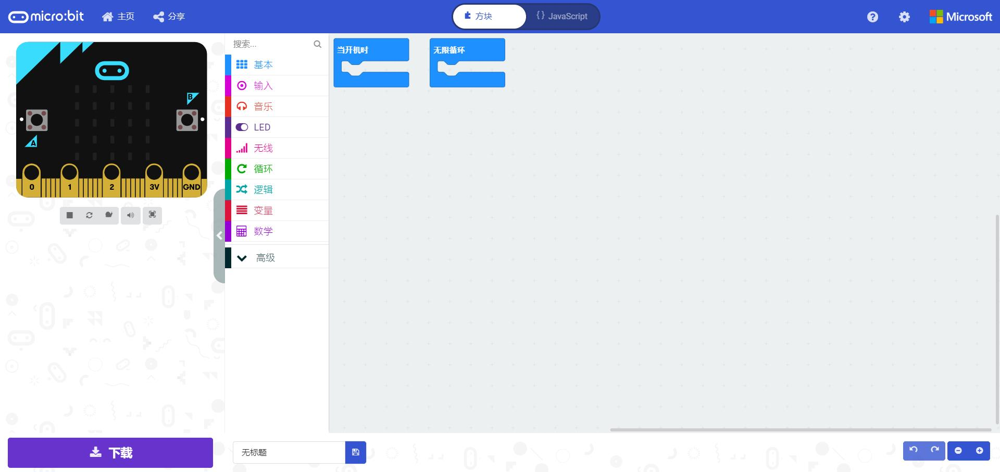
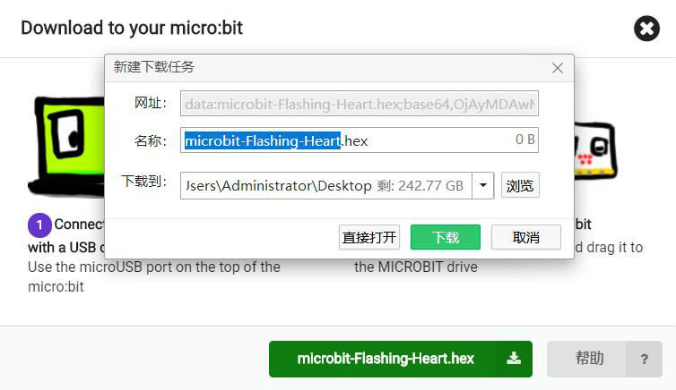
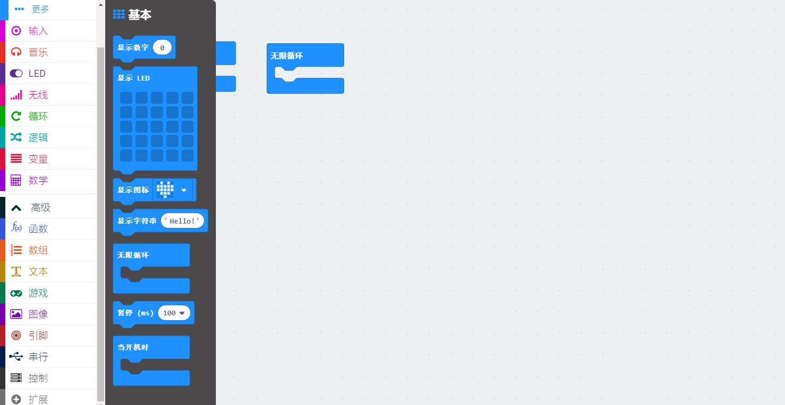
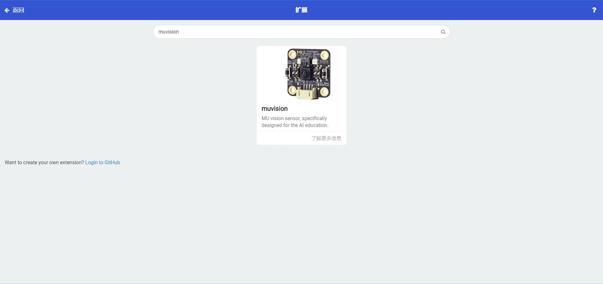
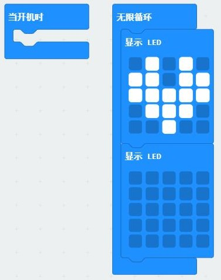

# 基础教程

## 简介
micro:bit是一款全球流行的STEAM教育开发板，由英国BBC广播公司开发。
micro:bit本身集成了传感器和灯光显示等外部设备，接入电脑即可编程体验基础功能；当插入扩展板类产品如麦昆小车，可以有更多的控制电机、氛围灯等功能。

micro:bit官方采用MakeCode软件进行编程。编程页面：[MakeCode在线编程](https://makecode.microbit.org/#)

本教程围绕MakeCode软件进行编程块的教学，逐步加入AI内容，帮助用户入门并掌握自动驾驶套件的内容。

## 编程界面

在主页“我的项目”中新建一个项目，进入编程界面。

### 程序烧录

在编程界面中，最左侧是模拟器和下载按钮，部分程序可以直接模拟运行查看效果，所有程序编译完成后都可以下载到micro:bit上运行。

micro:bit连上电脑后显示一个模拟U盘，将程序编译后生成的hex文件放入U盘就会重启micro:bit运行该程序。

### 编程块操作

界面中间是编程主界面，拖放可选择的编程块至右边即可编程，鼠标右键点击可重复、删除、显示帮助等操作，鼠标放置在编程块处会显示编程块的简单说明。

### 添加扩展

除了基础编程块，套件还会用到外部设备的扩展编程块，打开高级-扩展，搜索"muvision"添加MU视觉传感器相关编程块，搜索“maqueen”添加麦昆小车相关编程块。其他第三方编程块导入同理。

界面顶部可切换至代码编程，左侧会显示资源管理器，可查看程序相关源文件。本教程以可视化编程为主，代码仅做参考。

## 完整示例

拖动显示LED块到无限循环中，复制一个放到下方，将上方的LED灯点亮一个图案比如爱心，就是一个简单的闪动爱心的程序，在左边的模拟器可以看到模拟效果。

点击“下载”，编译生成hex文件，将micro:bit连接至电脑，将hex文件放入micro:bit模拟U盘。micro:bit将会自动重启，数秒后看到程序实际运行效果。

> Tips：默认块中，“当开机时”中的程序运行一次，然后进入“无限循环”中循环运行。
