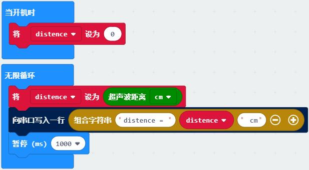
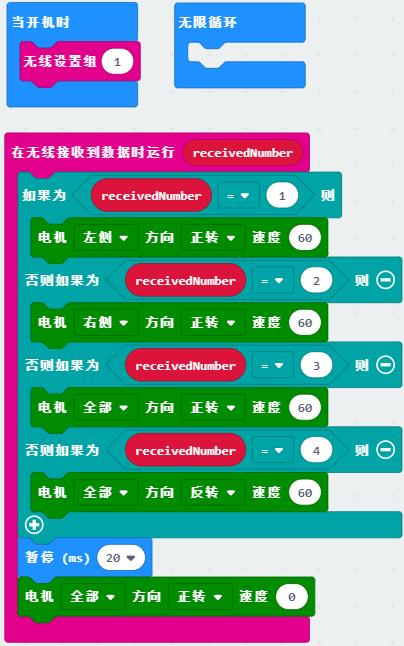
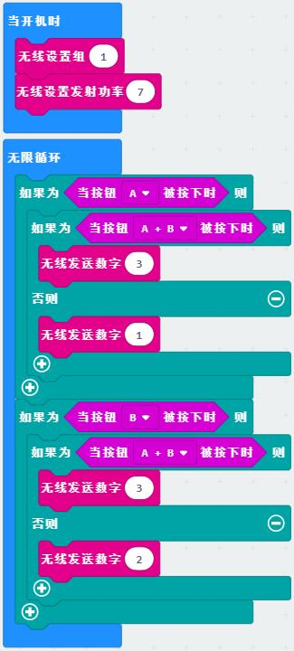
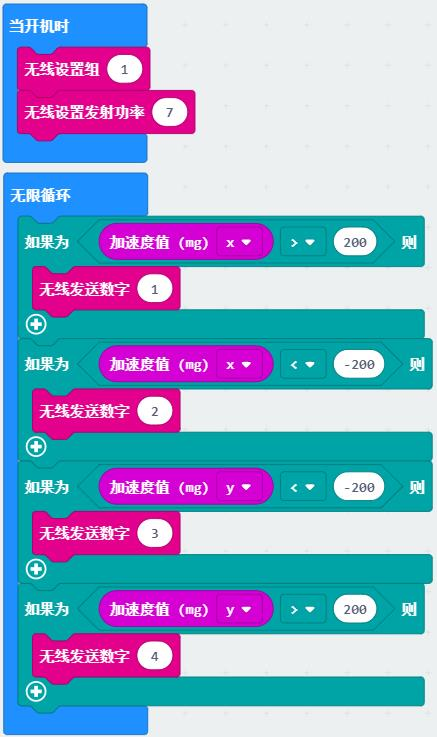

# 通讯类教程

在实际的设备与设备间、芯片与芯片间往往有各种通讯协议(protocol)，用于传输复杂的数据，本质是按照预定的规则收发数据。
在可视化编程中部分收发规则已简化，配置了默认的引脚、格式，而内部的数据类型、字符的协议需要用户自己定义。

## 串口

串口通讯（Serial Communication)是设备间常用的串行通讯方式，比如micro:bit与电脑间就可以通过串口收发数据。
串口常用于程序的调试环节，可以将程序中的数据配合一些解释通过串口打印在电脑上。
串口设备接入电脑后会显示相应的COM口，在此电脑右键左侧设备管理器中可以找到。

**示例：串口打印数据**

程序说明：用串口替代micro:bit的点阵来显示超声波测距数据，打印在控制台上。
用变量distence记录超声波测距的值，串口打印描述性的语句和distance的值来显示数据，常用于程序的调试。
在编程界面左侧打开“显示控制台 设备”即可看到串口返回的信息。

## 无线

micro:bit主控芯片自带无线通讯功能，是一种分组广播的通讯形式，当两块micro:bit设定在同一分组时即可收发数据。

**示例：无线遥控小车**

程序说明：此程序需要两块micro:bit，一块发送，一块接收。

接收端程序：无线接收字符以触发相应的动作。开机时匹配无线组1，无限循环为空。
在接收到无线数据时产生中断，根据无线接收到的数据让小车对应运动。

发射端程序：通过按键A B触发无线发送。开机时设置无线组1，发射功率为7。循环检测按键状态，当A、B或A+B被按下时通过无线发出对应字符。

程序扩展：体感遥控小车，将发射端程序改为加速度计触发，倾斜micro:bit来控制小车。当手中的micro:bit前后左右倾斜时让小车对应运动。

> Tips:这里无线发射和接收就是一个简单的通信协议，用数字1、2、3、4表示左转、右转、前进、后退。熟练以后可以设计更多复杂的协议。

## 蓝牙

