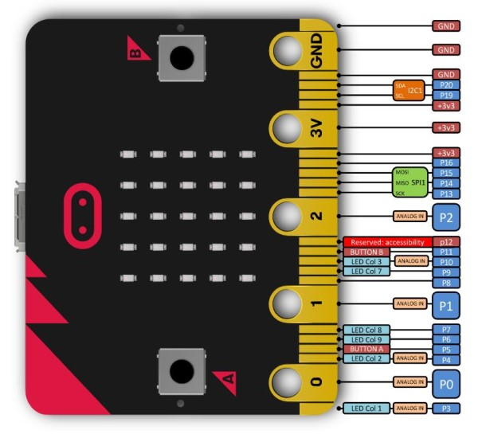
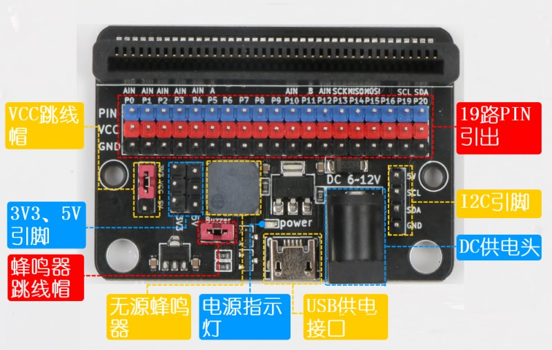
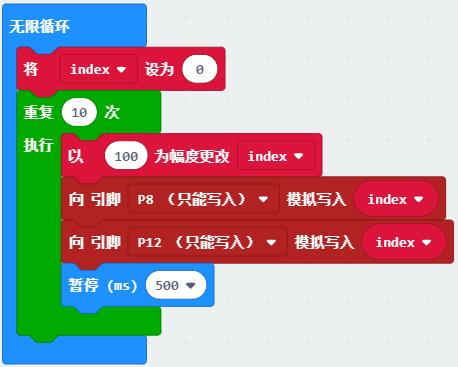
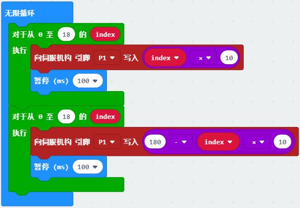

# 硬件高级教程

在Makecode中很多默认硬件相关的编程已做简化，而在使用外接设备时，比如插入扩展板，就涉及到引脚的相关控制。
在使用麦昆小车时就会涉及到引脚的精确使用，如蜂鸣器接在P0脚。
通过硬件相关的系统学习，在使用micro:bit外接传感器或执行器时就能如鱼得水，自由设计。

## GPIO

通用输入输出端口（GPIO）是主控芯片提供的可供编程的接口，对应着芯片上的各个引脚。
在micro:bit中有部分引脚已被系统使用，留出的引脚可供用户编程。在高级-引脚里可以看到引脚P0-P20中的部分可以使用。
而板载的按键、LED等外设（外部设备的简称）同样也用到了其中部分引脚。

micro:bit引脚图：

可以看到micro:bit可用的引脚已经通过金色的金手指引出，在套件中配了一块扩展板，则能将金手指转换成排针，方便连接舵机、LED等外部设备。
蓝色的是引脚插口，红色是VCC，黑色是GND。扩展板可用圆形DC口或USB口供电(扩展板USB口只能供电，不能下载)。

扩展板接口图：

示例：点亮红绿灯模块

程序说明：将红绿灯模块连接到扩展板的P15口，参考[串行灯程序](https://morpx-docs.readthedocs.io/zh_CN/latest/SelfDriving/SelfDriving_MakeCode/SelfDriving_MakeCode_actuator.html#id5)，用扩展板点亮红绿灯模块，程序下载完后用电池盒通过DC口供电，脱离USB线。

示例：GPIO输出

程序说明：将LED车灯示例用GPIO直接控制的方式来实现，在麦昆小车上找到车灯的引脚P8和P12，输出数字量1即可点亮，数字0关闭。

程序扩展：试试按键示例用数字读取引脚的值来实现。

## ADC与DAC

模拟量是在一定范围连续变化的变量，比如声音的大小。
数字量是时间上是不连续变化（离散）的量，比如开关的状态，只在0和1之间变化。

模拟量(Analog)与数字量(Digital)在电路中的转换过程称为ADC(模拟转数字)和DAC(数字转模拟)。
micro:bit中的ADC是指测量电压模拟量读取，用0-1024的数字返回结果，测得的电压为 

Volt = 3.3 * (Value/1024)

可以看到模拟转换为数字时有一定的精度，电压被分为1024份，测得的数字量约等于输入的模拟量。

示例：加速度值

程序说明：通过串口查看加速度值。下载程序后打开控制台，左右倾斜micro:bit，查看绘制的模拟曲线和返回的数字值。

DAC则相反，指定0-1024的数字模拟写入，输出对应的电压值为

Volt = 3.3 * (Value/1024)

示例：呼吸灯

程序说明：麦昆自带的车灯模块并没有调节车灯亮度的功能，但可以通过控制输出引脚的电压改变车灯亮度。
用模拟写入0-1000的值，车灯就有逐渐变亮的呼吸效果。

## PWM

PWM是指脉冲宽度调制，在指定的周期时间上输出一定比例的高电平脉冲来输出数字信号。
最常见的就是舵机的PWM信号，脉冲的周期是20ms，舵机角度0度对应高电平1ms，90度对应1.5ms，180度对应2ms。

示例:舵机PWM控制

程序说明：通过有引脚的PWM输出来控制舵机，向P1输出PWM信号。

## IIC SPI

提供了IIC、SPI等接口，在使用相应外设时可以调用接口进行通信。